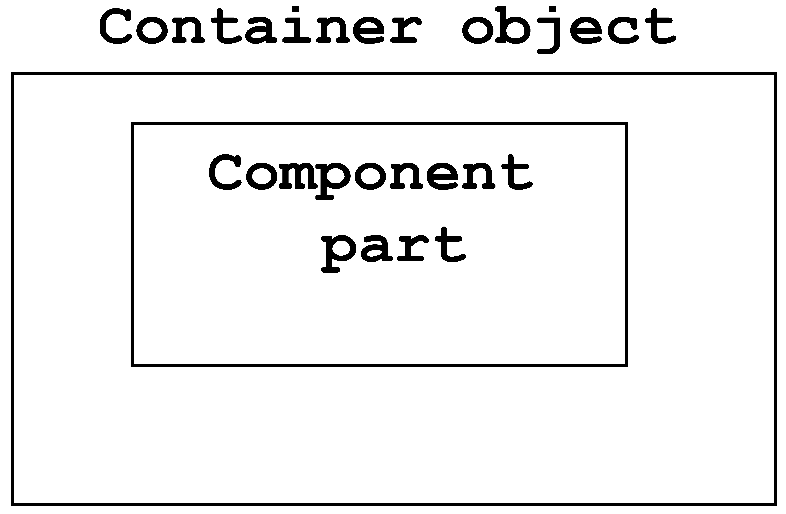
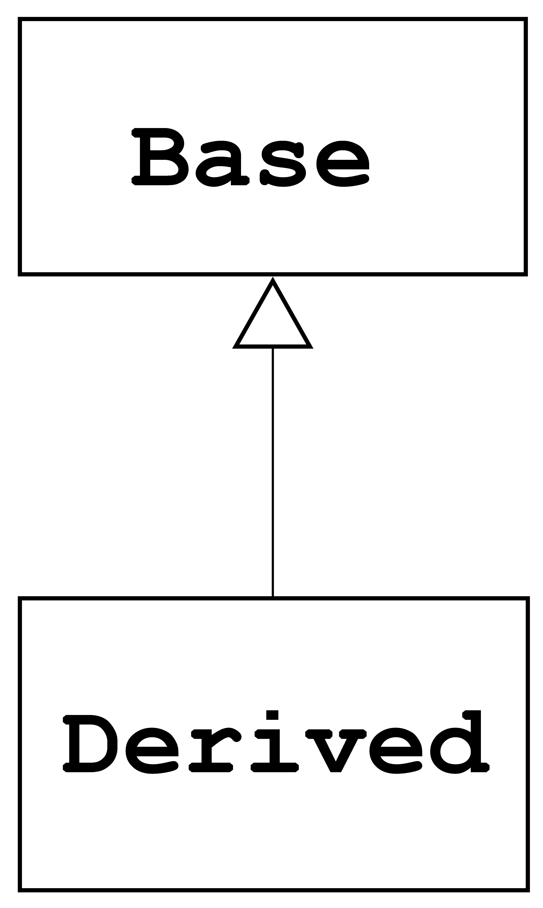
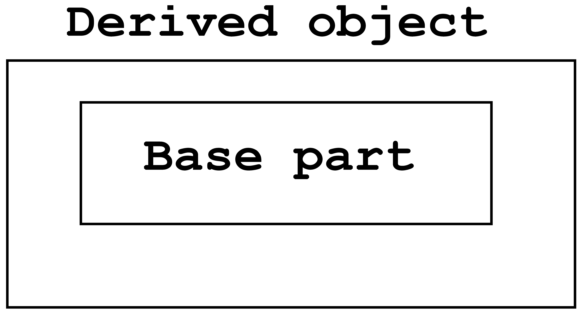

- [类的关系-复合与继承](#类的关系-复合与继承)
	- [1 . 复合关系](#1--复合关系)
		- [1.1 复合关系的类图表示：](#11-复合关系的类图表示)
		- [1.2 标准库中 `queue` 的实现就是运用了复合关系的模型：](#12-标准库中-queue-的实现就是运用了复合关系的模型)
		- [1.3 复合关系中的构造和析构函数](#13-复合关系中的构造和析构函数)
			- [1.3.1 类图](#131-类图)
			- [1.3.2 构造函数由内而外](#132-构造函数由内而外)
			- [1.3.3 析构函数由外而内](#133-析构函数由外而内)
	- [2 . 委托关系](#2--委托关系)
		- [2.1 委托关系的类图：](#21-委托关系的类图)
		- [2.2 语法示例](#22-语法示例)
	- [3 . 继承：`Inheritance`，表示 `is-a`](#3--继承inheritance表示-is-a)
		- [3.1 类图](#31-类图)
		- [3.2 语法示例](#32-语法示例)
		- [3.3 继承关系中的构造和析构函数](#33-继承关系中的构造和析构函数)
			- [3.3.1 类图](#331-类图)
			- [3.3.2 构造函数由内而外](#332-构造函数由内而外)
			- [3.3.3 析构函数由外而内](#333-析构函数由外而内)

# 类的关系-复合与继承

## 1 . 复合关系

 复合：`composition`，表示 `has-a`。

表示一个类中拥有另一个类，那么这个类和另一个类就是复合关系。

### 	1.1 复合关系的类图表示：


### 1.2 标准库中 `queue` 的实现就是运用了复合关系的模型：

```c++
template<class T>
class queue
{
	...
	protected:
		deque<T> c;	// 底层容器
    
    public:
    	// 以下功能完全利用 c 的操作函数完成
    	bool empty() const { return c.empty(); }
    	size_type size() const { return c.size(); }
    	reference front() { return c.front(); }
    	reference back() { return c.back(); }
    	//
    	void push( const value_type &x ) { c.push_back(x); }
    	void pop() { c.pop_front(); }
		
};
```


### 1.3 复合关系中的构造和析构函数

#### 	1.3.1 类图



#### 	1.3.2 构造函数由内而外

​	`Container` 的构造函数首先调用 `Component` 的默认构造函数，然后执行自己的构造函数。例如下面的模拟编译过程：「红色部分」是编译所加。

​	**Container :: Container(...) : <font color=red>Component()</font> { ... }**	


#### 	1.3.3 析构函数由外而内

`Container` 的析构函数首先调用自己的析构函数，然后执行 `Component` 的析构函数。

​	**Container :: ~Container() {   <font color=red>~Component()</font>;  }**


## 2 . 委托关系

委托：`Delegation，Composition by reference`。

一个类不是实际拥有另一个类的实体，而是通过引用来指向另一个类，从而实现这个类对另一个类的调用。

### 	2.1 委托关系的类图：


### 	2.2 语法示例

```c++
// String.hpp

class StringRep;
class String
{
	public:
		String( const char *s = 0 ){}
		String( const String &str );
		String& operator=( const String &str );
		~String() {}
	private:
		StringRep *rep;	// pimpl 

};


// StringRep.hpp
class StringRep
{
    
    public:
		StringRep( const char *s ){}
    	~StringRep(){}
    
    private:
    	int count;
    	char *rep;
    	friend class String;
    
};
```

以上代码示例的，类 `String` 提供的接口可以不用改动，而只需要改动 `StringRep` 中的实现，这种模式为经典的 `Handle/Body` 模型。

如下图所示，运用委托关系的模型实现引用计数的结构图。


## 3 . 继承

继承：`Inheritance`，表示 `is-a`。

一个派生类通过公有继承一个基类，实现继承关系。

### 	3.1 类图



### 3.2 语法示例

```c++
class Base
{
	public:
		
};

class Derived : public Base
{
    public:
}
```

### 3.3 继承关系中的构造和析构函数

#### 	3.3.1 类图



#### 3.3.2 构造函数由内而外

​	`Derived` 的构造函数首先调用 `Base` 的默认构造函数，然后执行自己的构造函数。例如下面的模拟编译过程：「红色部分」是编译所加。

​	Derived : : Derived( ... ) : <font color=red>Base()</font> { ... }	

#### 	3.3.3 析构函数由外而内

`Derived` 的析构函数首先调用自己的析构函数，然后执行 `Base` 的析构函数。

​	Derived : : ~Derived() {   <font color=red>~Base()</font>;  }

**父类的析构函数必须是虚析构函数**。

