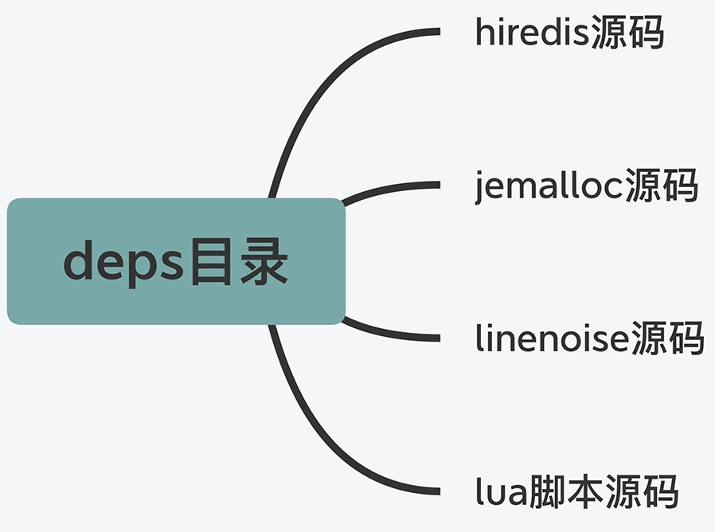
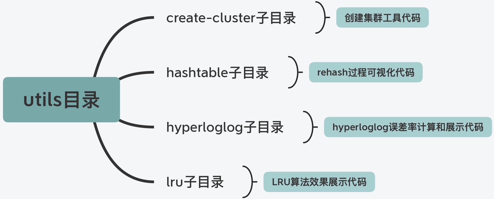
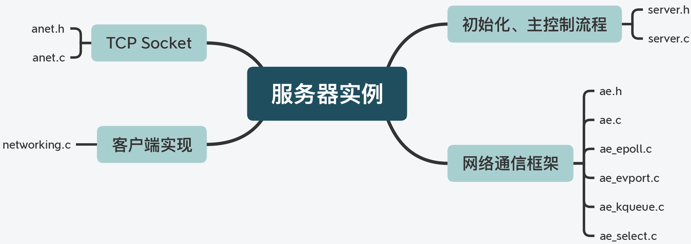
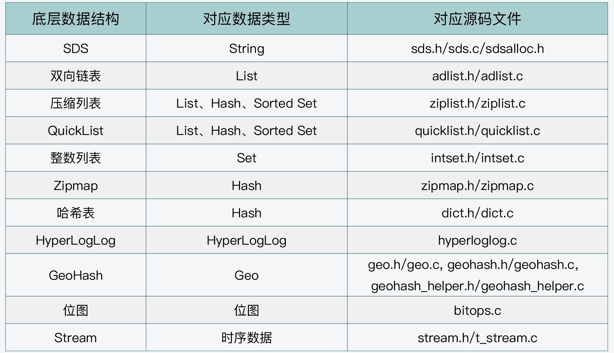
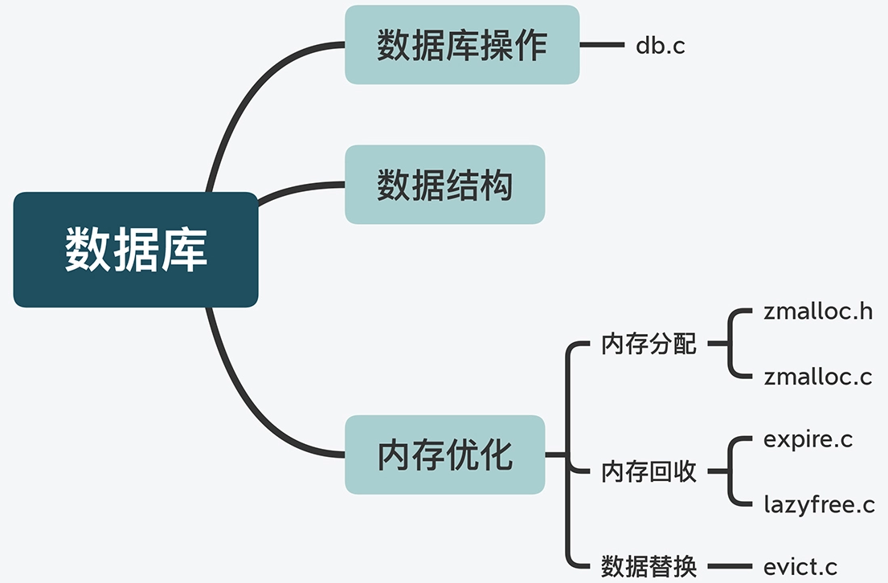

## `Redis` 源码框架

## 1. 代码的目录和作用划分

`Redis` 源码目录分为以下部分：`deps`、`src`、`tests`、`utils` 四个目录。

### 1.1 `deps` 三方库

主要包含了 `Redis` 依赖的第三方代码库。
其中包括 `Redis` 的 `C` 语言版本客户端代码 `hiredis`、`jemalloc` 内存分配器、用于替换 `readline` 功能的代码 `linenoise`和`lua` 脚本代码。这部分代码可以独立于 `Redis` 的源码 `src` 目录进行独立编译。如下图所示：

`Redis` 源码结构中含有第三方库的原因如下：

一方面，`Redis` 使用 `jemalloc` 库替换了 `C` 语言中原来的 `glibc` 库的内存分配器，使得 `Redis` 内存分配器的性能更高；
另一个方面，是 `Redis` 运行所需要的，但独立于 `Redis` 进行开发的功能代码，比如客户端代码。

### 1.2 `src` 源码

这个目录包含了 `Redis` 所有功能模块的代码文件，是 `Redis` 源码的重要组成部分。

### 1.3 `tests` 目录

主要是用于功能模块测试和单元测试的代码。`Redis` 实现的测试代码分为 **单元测试(`unit`)**、**集群测试(`cluster`)**、**哨兵功能测试(`sentinel`)** 和 **主从复制功能测试(`integration`)** 四个部分。如下目录结构：

### 1.4 `utils` 目录

用于 `Redis` 开发过程中的一些辅助性功能。如下结构：

### 1.5 配置文件

`Redis` 源码总目录下还包括两个重要的配置文件：

1. `Redis` 实例的配置文件 `redis.conf`；
2. 哨兵的配置文件 `sentinel.conf`。

## 2. 系统功能模块和对应代码文件

从服务器实例、数据库操作、可靠性和可扩展性保证和辅助功能四个维度梳理学习对应的 `src` 目录源码。

### 2.1 服务器实例

`Redis` 运行时是一个网络服务器，服务器实例的初始化和主体控制流程由 `server.h` 和 `server.c` 源码文件实现。与服务器实例相关的功能模块代码结构如下：

### 2.2 数据库数据类型与操作

`Redis` 数据库提供了丰富的键值对类型，其中包括了 `String、List、Hash、Set、Sorted Set` 五种基本键值类型。键值对类型和底层的数据结构的对应关系如下：

相关的数据库操作与源码关系如下：

## 3. 高可靠性和高可扩展性

`Redis` 一般是作为内存数据库来使用的，但它提供了可靠性保证，因为它既可以对数据做持久化保存，而且实现了主从复制机制。
而高可扩展性是通过 `Redis Cluster` 来实现的。

### 3.1 数据持久化实现

数据持久化实现主要有两种方式：内存快照 `RDB` 和 `AOF` 日志。
内存快照 `RDB` 在 `rdb.h/rdb.c` 实现，`AOF` 日志对应 `aof.c`。

### 3.2 主从复制实现

主从复制功能在 `replication.c` 文件中实现。

### 3.3 `Redis Cluster` 实现

`Redis Cluster`  在 `cluster.h/cluster.c` 中实现。