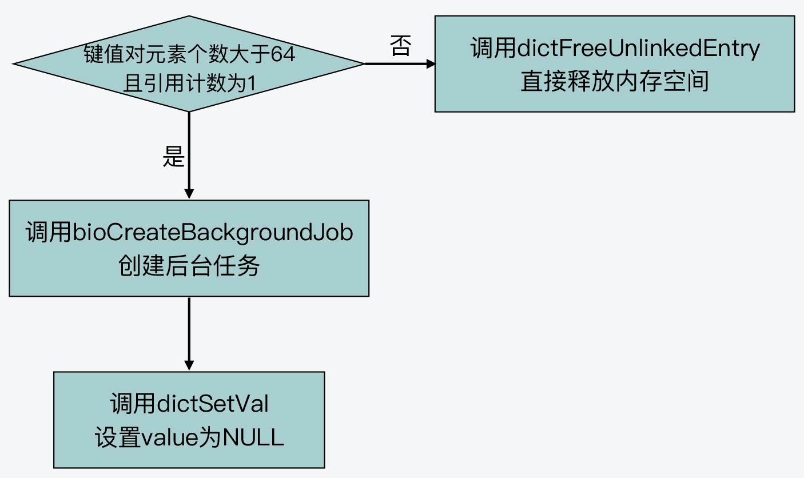

- [惰性删除 `lazy-free` 原理](#惰性删除-lazy-free-原理)
  - [1. 配置项](#1-配置项)
  - [2. 被淘汰数据的删除过程](#2-被淘汰数据的删除过程)
  - [3. 数据删除操作](#3-数据删除操作)
  - [4. 异步删除和同步删除](#4-异步删除和同步删除)
# 惰性删除 `lazy-free` 原理

# 1. 配置项

在 `Redis server`开始运行时，可以配置惰性删除的相关选项。

`lazyfree-lazy-eviction` ：表示缓存淘汰时的数据删除选项，它定义在 `server.h` 中结构体`redisServer`中，默认是 `no`。

当要开启惰性删除时，将 `lazyfree-lazy-eviction` 置为 `yes`。惰性删除开启后，它会使用 **后台线程** 来执行删除数据的任务，从而避免了删除操作对主线程的阻塞。

# 2. 被淘汰数据的删除过程

在对缓存中的数据淘汰时，函数 `evict.c/freeMemoryIfNeeded` 负责执行数据淘汰的过程，数据的删除过程主要分为两步。

```c
// evict.c
int freeMemoryIfNeeded(void) {
	...
    if (bestkey) {
            db = server.db+bestdbid;
            robj *keyobj = createStringObject(bestkey,sdslen(bestkey));
            propagateExpire(db,keyobj,server.lazyfree_lazy_eviction);
            delta = (long long) zmalloc_used_memory();
            latencyStartMonitor(eviction_latency);
            if (server.lazyfree_lazy_eviction)	// 开启惰性删除
                dbAsyncDelete(db,keyobj);    // 异步删除数据
            else
                dbSyncDelete(db,keyobj);	// 同步删除数据
    ...
}
```

## 2.1 指定删除命令

调用 `evict.c/propagateExpire` 函数，该函数根据全局变量 `server.lazyfree-lazy-eviction` 来决定删除操作具体执行`unlink/del`命令。

```c
void propagateExpire(redisDb *db, robj *key, int lazy) {
    robj *argv[2];	// struct redisObject，这是共享对象的数据结构

    argv[0] = lazy ? shared.unlink : shared.del;	// 结构体数组第一个元素存放执行的删除命令，如果开启惰性删除，则执行 unlink
    argv[1] = key;	// 第二个存放要删除的key对象
    incrRefCount(argv[0]);
    incrRefCount(argv[1]);

    if (server.aof_state != AOF_OFF)	// 是否开启了 AOF 日志，开启后则需把删除命令写入 AOF 日志
        feedAppendOnlyFile(server.delCommand,db->id,argv,2);
    replicationFeedSlaves(server.slaves,db->id,argv,2);		// 删除操作同步给从节点，保证主从数据一致性

    decrRefCount(argv[0]);
    decrRefCount(argv[1]);
}
```

如果开启了惰性删除选项，则执行 `unlink` 命令，否认执行 `del` 命令。

## 2.2 删除数据

根据是否开启惰性删除选项，`server` 决定是 **同步删除** 数据还是 **异步删除** 数据。

如果开启惰性删除，则 `freeMemoryIfNeeded` 函数调用 `lazyfree.c/dbAsyncDelete` 函数进行异步删除，否则是同步删除 `lazyfree.c/dbSyncDelete`。

# 3. 数据删除操作

数据删除操作包括两个步骤：从哈希表中删除要淘汰的键值对、释放被淘汰键值对所占用的内存空间。

因此，如果上述两个步骤一起执行，则为 **同步删除**；否则只做步骤一，步骤二由后台线程执行，则为 **异步删除**。

同步删除和异步删除分别由 `dictDelete` 和 `dictUnlink` 来执行，如下：

```c
/* Remove an element, returning DICT_OK on success or DICT_ERR if the
 * element was not found. */
int dictDelete(dict *ht, const void *key) {
    return dictGenericDelete(ht,key,0) ? DICT_OK : DICT_ERR;
}

dictEntry *dictUnlink(dict *ht, const void *key) {
    return dictGenericDelete(ht,key,1);
}
```

数据的删除操作由定义在 `dict.c/dictGenericDelete` 来执行，根据传入的参数 `nofree` 来决定是否同步或异步删除数据。

```c

// dict.c
static dictEntry *dictGenericDelete(dict *d, const void *key, int nofree) {
    uint64_t h, idx;
    dictEntry *he, *prevHe;
    int table;

    if (d->ht[0].used == 0 && d->ht[1].used == 0) return NULL;

    if (dictIsRehashing(d)) _dictRehashStep(d);
    h = dictHashKey(d, key);	// 查找 key 对应的哈希值

    for (table = 0; table <= 1; table++) {
        idx = h & d->ht[table].sizemask;	// 根据 key 计算对应的哈希桶编号
        he = d->ht[table].table[idx];	// 获取 key 所在哈希桶的第一个哈希项
        prevHe = NULL;
        while(he) {	// 遍历 key 是否存在
            if (key==he->key || dictCompareKeys(d, key, he->key)) {
                /* Unlink the element from the list */
                if (prevHe)
                    prevHe->next = he->next;
                else
                    d->ht[table].table[idx] = he->next;
                if (!nofree) {	// 如果是同步删除，则立即释放 key 和 val 的内存空间
                    dictFreeKey(d, he);
                    dictFreeVal(d, he);
                    zfree(he);
                }
                d->ht[table].used--;
                return he;
            }
            prevHe = he;
            he = he->next;
        }
        if (!dictIsRehashing(d)) break;
    }
    return NULL; /* not found */
}
```

## 4. 异步删除和同步删除

异步删除过程为：`lazyfree.c/dbAsyncDelete--->dict.c/dictUnlink--->dict.c/dictGenericDelete(ht,key,1)`。

首先在 `lazyfree.c/dbAsyncDelete` 中由 `lazyfreeGetFreeEffort` 函数评估被删除键值对的删除开销，当被淘汰的键值对包含超过 `64` 个元素的集合类型时，则创建 **后台线程** 来执行删除操作。否则 **主线程** 直接调用 `dict.c/dictFreeUnlinkedEntry` 来释放键值对的空间。



同步删除调用 `dict.c/dictDelete--->dict.c/dictGenericDelete(ht,key,0)`，来执行。

