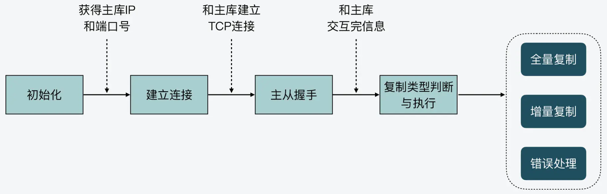

# `redis` 主从复制

# 1. 主从复制

`Redis` 主从复制主要包括了 **全量复制、增量复制和长连接同步** 三种情况。

全量复制：用于传输 `RDB` 文件；

增量复制：传输主从断连期间的命令；

长连接同步：把主节点正常收到的请求传输给从节点。

## 1.1 同步操作

在`Redis`中，客户端可以通过想服务器发送`SLAVEOF`命令，让一个服务器去复制另一个服务器，那么被复制的服务器为主服务器（`master`），对主服务器执行复制操作的服务器是从服务器（`slave`）。如下所示：

从服务器对主服务器的同步操作需要通过向主服务器发送`SYNC`命令来完成。以下是`SYNC`命令的执行步骤：

1. 从服务器向主服务器发送`SYNC`命令；
2. 收到`SYNC`命令的主服务器执行`BGSAVE`命令，后台生成一个`RDB`文件，并使用缓存区记录从现在执行的所有写命令；
3. 当主服务器的`BGSAVE`命令执行完成后，将生成好的`RDB`文件发送给从服务器，从服务器载入收到的`RDB`文件，将自己的数据库状态更新至主服务器执行`BGSAVE`命令时的状态；
4. 主服务器将记录在缓存区的所有写命令发送给从服务器，从服务器执行这些命令，将自己的数据库状态更新至主服务器数据库当前所处的状态。

命令`SYNC`是一个非常耗时的操作，因此`Redis`应保证真正需要时才执行`SYNC`命令。

## 1.2 断线重连复制

在从服务器断线重连主服务器后，会重新发送`SYNC`命令，再次进行主从 **完整重同步**，这样对`Redis`将是非常低效的操作。而`PSYNC`命令是对`SYNC`命令的一种改进，这个命令是在从服务器断线重连后，主从服务器执行 **部分重同步** 操作，主服务器将在主从断线期间所有的写命令发给从服务器，从服务器只执行这些命令来更新数据库状态。

# 2. 主从复制的阶段

主从复制主要分为四个阶段：初始化、建立连接、主从握手和复制类型判断与执行。

## 2.1 初始化

当一个 `redis` 实例 `A` 设置为另一个实例 `B` 的从库时，实例 `A` 要完成初始化操作。从库主要是获取主库的 `IP` 和端口号。 

## 2.2 建立连接阶段

当从库获取到主库的 `IP` 和端口号后，该实例就会尝试和主库建立 `TCP` 连接，从而可以在建立好的连接上，监听是否主库发送的命令。

## 2.3 主从握手

当从库和主库建立好连接后，该实例就会和主库进行握手。握手过程就是主从库间发送 `PING-PONG` 消息，同时从库根据配置信息向主库进行验证。

## 2.4 复制类型判断与执行

当主从库握手完成后，从库就会给主库发送 `PSYNC` 命令。主库会根据从库发送的命令参数作出相应的三种回复：执行全量备份、执行增量备份和发生错误。

最后，从库根据主回复的复制类型，执行对应的复制操作。

整个实现的阶段如下：

