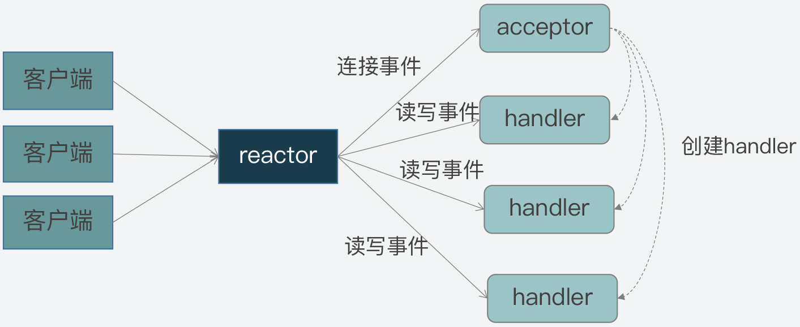

# `Redis`事件驱动框架：`Reactor`模型

# 1. `Reactor` 模型

`Reactor` 模型的核心是将多个`I/O`事件注册到一个中央多路复用器上，主线程会阻塞在多路复用器上。而当一个`I/O`事件到达或准备就绪，多路复用器会将预先注册的相应`I/O`事件返回并分发给相应的处理器。

`Reactor` 模型本质是网络服务器端用来处理高并发网络`IO`事件的一种编程模型，因此，它是高性能网络系统实现高并发请求处理的一个重要技术方案。

## 1.1 事件类型与角色

`Reactor` 模型的特征可以由不同的事件类型与角色概括：

1. 事件类型：连接事件、读事件和写事件；
2. 角色类型：`reactor`、`acceptor` 和 `handler`。

### 1.1.1 事件类型

客户端与服务器在交互过程中，会产生三类不同的事件类型：

1. 连接事件：客户端向服务器发起连接请求，对应服务器的一个连接事件；
2. 写事件：服务器将客户端发送的请求处理结果写回给客户端，则对应了服务器端的写事件；
3. 读事件：服务器要从客户端读取请求内容，则对应了服务器的读事件。

### 1.1.2 事件处理

在上面的三类事件产生后，则由模型中的角色来分别处理对应事件：

1. 连接事件：由`acceptor`处理，负责服务器接收客户端的连接。`acceptor`接收连接后，会创建`handler`来处理网络连接上的读写事件；
2. 读写事件：由`handler`处理；
3. 在高并发的网络通信中，事件的到达是随机的、异步的。因此，需要一个专门的角色来监听和分配事件，即`reactor`反应器。`reactor`会将连接事件分配给`acceptor`，读写事件分配给`handler`。



# 2. `Reactor` 实现

在实现`Reactor`模型时，事件驱动框架通过包括两个部分：

1. 事件的定义与注册；
2. 事件捕获、分发和处理等。

`Redis`中对`Reactor`模型的代码实现在 [`ae.h`](https://github.com/redis/redis/blob/unstable/src/ae.h) 和 [`ae.c`](https://github.com/redis/redis/blob/unstable/src/ae.c)。文件中定义了事件驱动框架运行的主要函数：

1. 框架主循环`aeMain`函数；
2. 负责事件与`handler`注册的`aeCreateFileEvent`函数；
3. 事件捕获与分发的`aeProcessEvents`函数。

函数原型如下：

```c

// ae.h
void aeMain(aeEventLoop *eventLoop);    // 事件主循环函数
int aeCreateFileEvent(aeEventLoop *eventLoop, int fd, int mask,
        aeFileProc *proc, void *clientData);    // 事件注册函数 
int aeProcessEvents(aeEventLoop *eventLoop, int flags);    // 事件捕获与分发函数 
```

## 2.1 事件和处理函数的注册

在函数`ae.c/aeCreateFileEvent`中，注册要监听的事件和相应的事件处理函数。

`Redis`服务器程序启动后，`main`函数会调用`initServer`函数进行初始化操作，这个过程会调用`aeCreateFileEvent`函数。

```c

// ae.c
int aeCreateFileEvent(aeEventLoop *eventLoop, int fd, int mask,
        aeFileProc *proc, void *clientData)
{
    if (fd >= eventLoop->setsize) {
        errno = ERANGE;
        return AE_ERR;
    }
    aeFileEvent *fe = &eventLoop->events[fd];
	// 事件注册：在Linux下调用epoll_ctl
    if (aeApiAddEvent(eventLoop, fd, mask) == -1)
        return AE_ERR;
    fe->mask |= mask;
    if (mask & AE_READABLE) fe->rfileProc = proc;    // 读事件处理函数
    if (mask & AE_WRITABLE) fe->wfileProc = proc;    // 写事件处理函数
    fe->clientData = clientData;
    if (fd > eventLoop->maxfd)
        eventLoop->maxfd = fd;
    return AE_OK;
}
```


## 2.2 事件的捕获

在函数`ae.c/aeProcessEvents`中，`Redis`会调用`aeApiPoll`函数来捕获发生的网络事件，如下：

```c
int aeProcessEvents(aeEventLoop *eventLoop, int flags)
{
	int processed = 0, numevents;

    /* Nothing to do? return ASAP */
    if (!(flags & AE_TIME_EVENTS) && !(flags & AE_FILE_EVENTS)) return 0;

    /* Note that we want call select() even if there are no
     * file events to process as long as we want to process time
     * events, in order to sleep until the next time event is ready
     * to fire. */
    if (eventLoop->maxfd != -1 ||
        ((flags & AE_TIME_EVENTS) && !(flags & AE_DONT_WAIT))) {
        
        ...

        /* Call the multiplexing API, will return only on timeout or when
         * some event fires. */
        numevents = aeApiPoll(eventLoop, tvp);
		
        ...

    return processed; /* return the number of processed file/time events */
}

```

`aeApiPoll`函数使用`IO`多路复用机制，来实现事件的捕获。在`Linux`系统下，它封装了`epoll_wait`函数来检测内核中就绪的`IO`事件。

