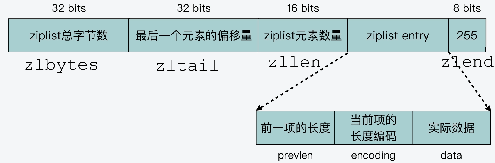
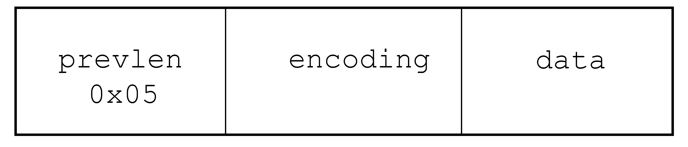
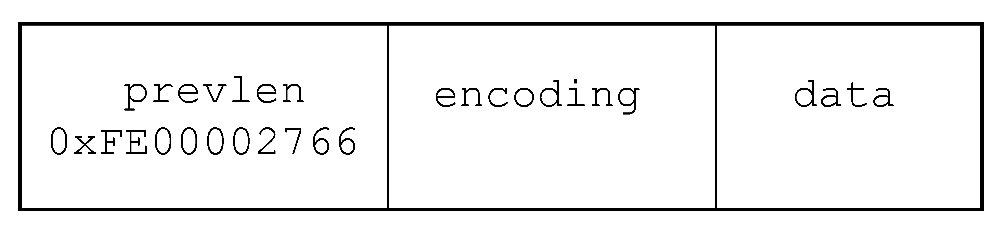
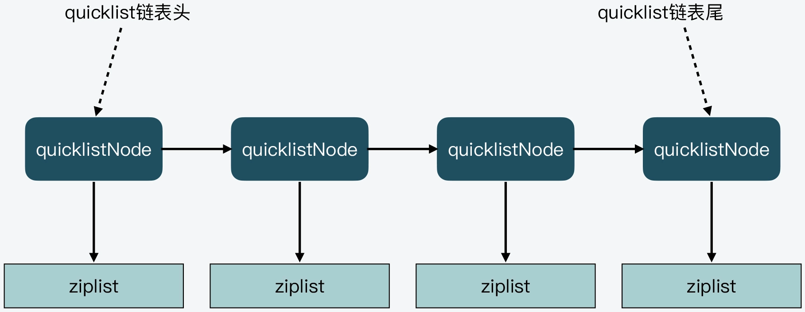
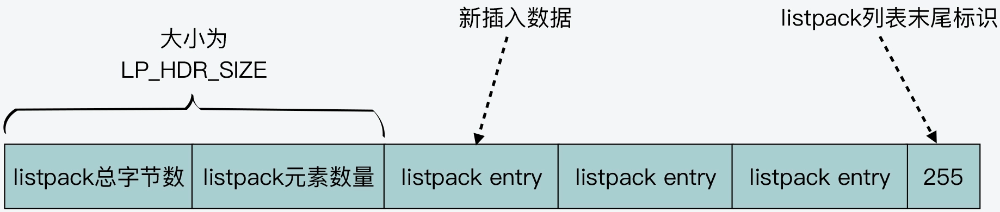
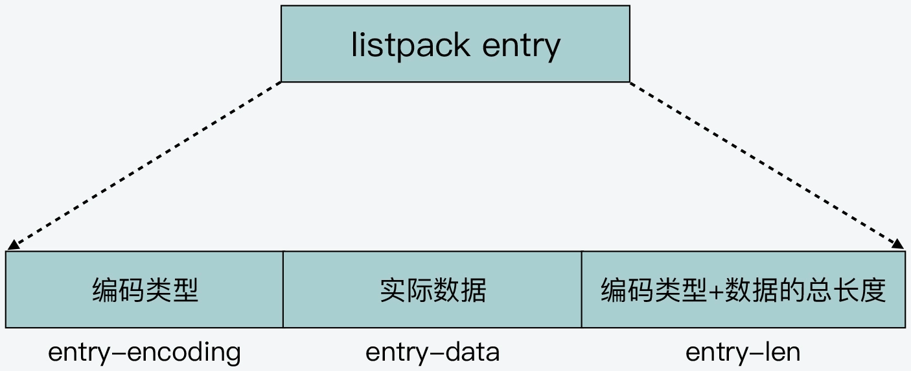

- ## [`ziplist、quicklist、listpack` 的关系](#ziplistquicklistlistpack-的关系)
  
  - [1. `ziplist`](#1-ziplist)
    - [1.1 `ziplist`的组成](#11-ziplist的组成)
    - [1.2 `ziplist` 中节点的组成](#12-ziplist-中节点的组成)
      - [1.2.1 `prev_entry_length (prevlen)`](#121-prev_entry_length-prevlen)
      - [1.2.2 `encoding`](#122-encoding)
      - [1.2.3 `data`](#123-data)

# `ziplist、quicklist、listpack` 的关系

# 1. `ziplist`

`ziplist` 是压缩列表，它是一种内存紧凑型的数据结构，占用一段连续的内存空间，以达到节省内存的目的。一个压缩列表可以包含任意多个节点，每个节点保存一个字节数组或一个整数值。创建一个压缩列表的函数如下：

```c

//ziplist.c

/* The size of a ziplist header: two 32 bit integers for the total
 * bytes count and last item offset. One 16 bit integer for the number
 * of items field. */
#define ZIPLIST_HEADER_SIZE     (sizeof(uint32_t)*2+sizeof(uint16_t))

/* Size of the "end of ziplist" entry. Just one byte. */
#define ZIPLIST_END_SIZE        (sizeof(uint8_t))

unsigned char *ziplistNew(void) {
    unsigned int bytes = ZIPLIST_HEADER_SIZE+ZIPLIST_END_SIZE;
    unsigned char *zl = zmalloc(bytes);
    ...
    zl[bytes-1] = ZIP_END;
    return zl;
}
```

`ziplist`是列表键、哈希键和有序集合的底层实现之一。当一个列表键只包含少量列表项，且每个列表项是小整数值或较短字符串时，`Redis` 就使用压缩列表来作为列表键的底层实现。同理，哈希键只包含少量键值对时，且每个键值对的键和值是小整数值或较短字符串时，就用压缩列表来作为哈希键的底层实现。

## 1.1 `ziplist`的组成

`ziplist` 列表头的各个组成部分为：

1. `zlbytes` ：占用 `4` 个字节，保存整个压缩列表的 **总字节数**，在对压缩列表进行重新内存分配，或者定位 `zlend` 位置时使用；

2. `zltail` ：占用 `4` 个字节，记录列表 **表尾节点** 距离列表起始地址的偏移量，这样可以快速定位 `ziplist` 最后一个节点位置；

3. `zllen` ：占用 `2` 个字节，记录列表中的 **总节点数**，列表中间可以包含若干个节点（`entry`）；

4. `zlend` ：占 `1` 个字节，是固定值 `0xFF`，表示压缩 **列表的结束**。

如下所示：



## 1.2 `ziplist` 中节点的组成

压缩列表中每一个节点（`entry`）由 `prevlen`、`encoding`、`data` 三部分组成。

### 1.2.1 `prevlen`

属性`prevlen` 以字节为单位，记录前一个节点的长度，它本身的长度是 `1`或 `5` 个字节：

如果前一个节点的长度小于 `254` 个字节，则 `prevlen` 属性占用的长度为 `1` 字节。否则 `prevlen` 的长度是 `5` 个字节，且属性的第一个字节是 `0xFE（十进制254）`，之后的 `4` 个字节则用于保存前一个节点的长度。

如下所示，一个节点的结构，`prevlen` 属性值是 `0x05`，表示前一个节点长度为 `5` 字节。



下图所示是包含 `5` 个字节长 `prevlen` 属性的压缩列表节点，属性值为 `0xFE00002766`，值的最高位字节为 `0xFE`，之后的四个字节`0x00002766` （十进制 `10086`）才是前一个节点的真实长度。


所以，属性 `prevlen` 的一个重要功能是可以根据当前节点的地址来计算出前一个相邻节点的起始地址。压缩列表的 **从表尾到表头遍历** 操作就是根据这一原理实现的。

### 1.2.2 `encoding`

`encoding` 属性记录了当前节点 `data` 属性所保存数据的类型和长度：

- `1` 字节、`2` 字节或者 `5` 字节长，值的最高位为 `00、01 或 10` 的是字节数组编码：这种编码表示节点的 `data` 属性保存着字节数组，数组的长度由编码除去最高两位之后的其他位记录；
- `1` 字节长，值的最高位以 `11` 开头的是整数编码：这种编码表示节点的 `data` 属性保存着整数值，整数值的类型和长度由编码除去最高两位之后的其他位记录。

### 1.2.3 `data`

节点 `data` 保存当前节点的实际内容，节点值可以是一个字节数组或整数，值的类型和长度由 `encoding` 属性决定（一个长度为`5`的字节数组）。


## 1.3 缺点

虽然 `ziplist` 通过紧凑的内存布局来保存数据，节省了内存空间，但也存在以下的缺点：

1. 查询复杂度高：查询列表中间的元素时，需要从列表头或列表尾遍历才行。
2. 连锁更新风险：当插入一个元素或删除一个元素时，可能会导致多个节点的内存重新分配。

# 2. `quicklist`

`quicklist` 结合了链表和压缩列表的各自优势，即一个 `quicklist` 本质是一个链表，而链表中的每个元素又是一个`ziplist`。

以下是`quicklist` 的节点结构定义：

```c
// quicklist.h
typedef struct quicklistNode {
    struct quicklistNode *prev;
    struct quicklistNode *next;
    unsigned char *zl;			/* quicklist 指向的 ziplist */
    unsigned int sz;             /* ziplist size in bytes：ziplist 的字节大小 */
    unsigned int count : 16;     /* count of items in ziplist：ziplist 中的元素个数 */
    unsigned int encoding : 2;   /* RAW==1 or LZF==2 */
    unsigned int container : 2;  /* NONE==1 or ZIPLIST==2 */
    unsigned int recompress : 1; /* was this node previous compressed? */
    unsigned int attempted_compress : 1; /* node can't compress; too small */
    unsigned int extra : 10; 	/* more bits to steal for future usage */
} quicklistNode;
```

`quicklist`的定义：

```c
// quicklist.h
typedef struct quicklist {
    quicklistNode *head;
    quicklistNode *tail;
    unsigned long count;        /* total count of all entries in all ziplists */
    unsigned long len;          /* number of quicklistNodes */
    int fill : 16;              /* fill factor for individual nodes */
    unsigned int compress : 16; /* depth of end nodes not to compress;0=off */
} quicklist;

```



`quicklist`会控制每个节点`quicklistNode`中`ziplist`的大小或元素个数，可以有效减少`ziplist`中连锁更新的情况。

# 3. `listpack`

`listpack`是`Redis`新引入的一种数据结构，也是用一块连续的内存空间来紧凑地保存数据。但`listpack`的列表项使用了多种编码方式，来表示不同长度的数据（整数或字符串），从而节省内存空间。

它的结构如下：



`LP_HDR_SIZE`：`listpack`头部大小，占`6`个字节大小。其中`listpack`总字节数占`4`个字节，`listpack`元素个数占`2`个字节。

其中的列表项结构如下：

