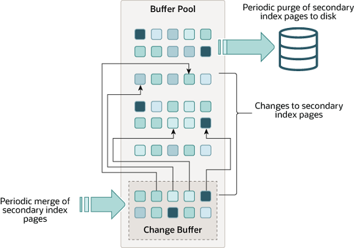

# `MySQL` `Change Buffer` 原理

## 1. `Change Buffer` 定义

`Change Buffer` 是一项特殊的数据结构，它仅支持对 **二级索引页** 的缓存。当要修改的二级索引页不在缓存池时，它会缓存对 **二级索引页** 的修改。

二级索引页的修改可能是由 `DML` 语句产生的，之后在其他读操作将对应的页面载入缓存池时进行合并缓存的更改。



与聚簇索引不同，二级索引通常是非唯一的。那么二级索引上的插入操作是相对随机的顺序，同样，更新和删除操作可能影响索引树中不相邻的二级索引页。

稍后在其他操作将修改的页面读入缓冲池时合并缓存的更改，可避免大量随机访问 `I/O`，而这些 `I/O` 将需要将二级索引页面从磁盘读入缓冲池。

在内存中，`Change Buffer` 占据缓冲区的一部分。在磁盘上，它是系统表空间的一部分，`Change Buffer` 的修改会写入系统表空间。

## 2. 监控 `Change Buffer`

`InnoDB` 引擎通过命令 `SHOW ENGINE INNODB STATUS\G` 输出 `Change Buffer` 的信息 `INSERT BUFFER AND ADAPTIVE HASH INDEX`：

```mysql
mysql> SHOW ENGINE INNODB STATUS\G

-------------------------------------
INSERT BUFFER AND ADAPTIVE HASH INDEX
-------------------------------------
Ibuf: size 1, free list len 0, seg size 2, 0 merges
merged operations:
 insert 0, delete mark 0, delete 0
discarded operations:
 insert 0, delete mark 0, delete 0
Hash table size 4425293, used cells 32, node heap has 1 buffer(s)
13577.57 hash searches/s, 202.47 non-hash searches/s
```

## 3. `Change Buffer` 参数

`innodb_change_buffer_max_size` 表示 `InnoDB` 中 `Change Buffer` 的最大大小，指定占用 `Buffer Pool` 的百分比，默认值是 `25`，即占用 `Buffer Pool` 空间的 `25%`，最大值是 `50`。

