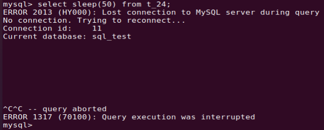

- [kill 命令](#kill-命令)
  - [1. MySQL 中的 KILL 命令用法](#1-mysql-中的-kill-命令用法)
  - [2. KILL 命令执行流程](#2-kill-命令执行流程)

# kill 命令

[MySQL 32讲](https://time.geekbang.org/column/article/79026)

## 1. MySQL 中的 KILL 命令用法

语法：`KILL [CONNECTION | QUERY] processlist_id`

`KILL QUERY + processlist_id` ：终止当前执行的语句，但连接本身是存在的。

`KILL CONNECTION + processlist` 中的 `CONNECTION` 可以缺省，即与`KILL` 命令是相同的作用。
但是，`KILL` 命令是直接断开连接的，断开连接后会自动重连后会重新执行上次被中断的语句。

## 2. KILL 命令执行流程

在 `MySQL` 中，当给执行中的线程发送一个 `kill` 命令时，分为以下两个步骤：

1. 将目标线程的运行状态改成 `KILL_QUERY` （`kill query + id`）或 `KILL_CONNECTION` （`kill + id`）；
2. 给目标线程发一个 "停止" 的信号。

因此，当一个线程收到终止信号后，需要执行到判断状态的 "埋点"，语句才开始进入终止逻辑，到终止逻辑完全完成，是有一个过程的。

