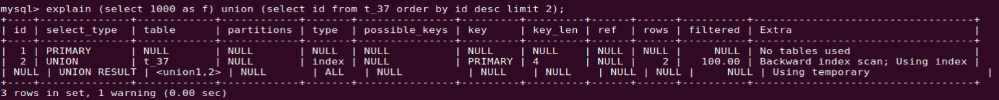
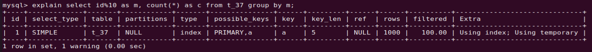

- [MySQL 临时表](#mysql-临时表)
  - [1. 临时表](#1-临时表)
    - [1.1 临时表的特点](#11-临时表的特点)
  - [2. 临时表与主备复制](#2-临时表与主备复制)
  - [3. 内存临时表的使用场景](#3-内存临时表的使用场景)
    - [3.1 `union` 语句的执行](#31-union-语句的执行)
    - [3.2 group by 执行](#32-group-by-执行)

# MySQL 临时表

[MySQL 37讲](https://time.geekbang.org/column/article/80477)

临时表分为两类：

1.  在`MySQL` 内部执行一些`SQL` 语句时被隐式创建，称为内存临时表；
2.  由用户在客户端手动创建，称为普通临时表。 

## 1. 临时表

在创建表时，表名前面加 `temporary` 可以指定要创建的表为临时表。但是临时表不等同于内存表，当创建临时表并指定引擎是 `memory` 时，该临时表才为内存表，否则为普通临时表。内存表的数据存在内存中，重启后表会被清空，而普通临时表的读写数据会存在磁盘上。
但临时表在创建它的线程退出后，这个临时表会被自动删除。

```mysql
-- 创建一个内存临时表
create temporary table t(id int primary key)engine = memory;

-- 创建一个普通临时表
create temporary table t(id int primary key)engine = innodb; 	

-- 创建一个普通表
create table t(id int primary key);

```

### 1.1 临时表的特点

-   临时表只对创建它的`session` 可见，其他的 `session` 不能访问这个临时表。因此，不同 `session` 可以创建同名的临时表；
-   临时表可以与普通表重名；
-   当一个 `session` 中含有同名的临时表和普通表时，`show create` 命令，以及对表的增删改查操作都是对临时表的操作；
-   `show tables` 不显示临时表。

## 2. 临时表与主备复制

当 `binlog` 日志是 `row-based` 格式时，`binlog` 不会记录临时表的创建等操作。

## 3. 内存临时表的使用场景

`MySQL` 在执行一些 `SQL` 语句过程中会自动创建内存临时表，用来存储中间数据，从而辅助 `SQL` 语句的功能实现。内存临时表的大小由参数 `tmp_table_size` 控制，默认大小是 `16M` 。
下面是一些 `MySQL` 创建内部临时表的场景。

### 3.1 `union` 语句的执行

```mysql
create table t_37(id int primary key, a int, b int, index(a));

(select 1000 as f) union (select id from t_37 order by id desc limit 2);
```



如图：在 `Extra` 字段显示 `Using temporary` 时，表示这个语句执行过程中会创建临时表。
这个语句的执行流程是这样的：

1.  创建一个内存临时表，这个表只有一个整型字段 `f`，并且它是主键；
2.  执行第一个查询，得到结果 `1000` 这个值，并存入临时表中；
3.  执行第二个查询：
    -   拿到 `1000` 这个值，试图插入临时表中，但表中已有 `1000` 这个值，违反了唯一性约束，则插入失败，继续执行；
    -   拿到 `999` 这个值，成功插入临时表。
4.  从临时表中按行取出数据，返回结果。然后删除临时表，整个语句执行结束。

因此，这个由 `MySQL` 系统自动创建的内存临时表，起到了暂存数据的作用，并且使用了临时表主键 `id` 的唯一性约束，实现了 `union` 语义功能。

### 3.2 group by 执行

`group by` 逻辑是分组统计给定字段不同的值出现的次数，所以会创建一个**带唯一索引的临时表**。如以下语句，它的逻辑是把表中数据按照 `id%10` 进行分组统计然后返回结果：

```mysql
select id%10 as m, count(*) as c from t_37 group by m;
```



从 `Extra` 字段可以看出：

1.  `Using index` ：使用了覆盖索引；
2.  `Using temporary` ：使用了临时表；

这个语句的执行流程是这样的：

1.  创建内存临时表，表里有两个字段 `m 和 c`，主键是 `m`；
2.  扫描表 `t_37` 的索引 `a`，依次取出叶子节点上的 `id` 值，计算 `id%10` 的结果，记为 `x`；
    -   如果临时表中没有主键为 `x`的行，就插入一个记录 `(x,1)`；
    -   如果表中有主键为 `x` 的行，就将 `x` 这一行的 `c` 值加 `1`；
3.  遍历完成后，得到结果集返回给客户端。

需要注意的是，当内存临时表空间不足时，内存临时表会转为磁盘临时表。

