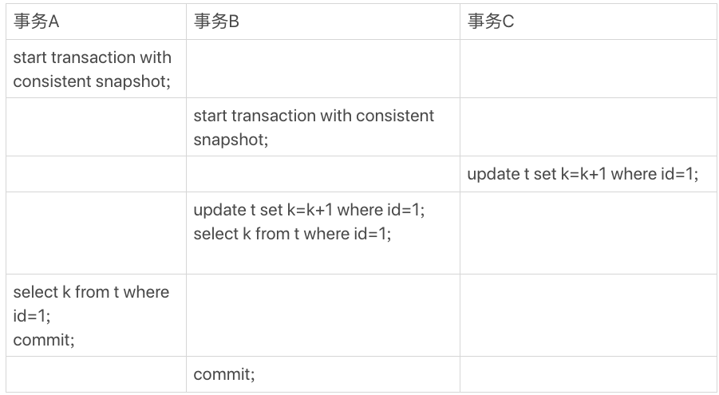
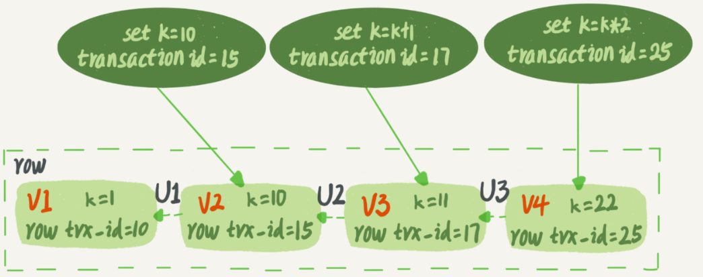
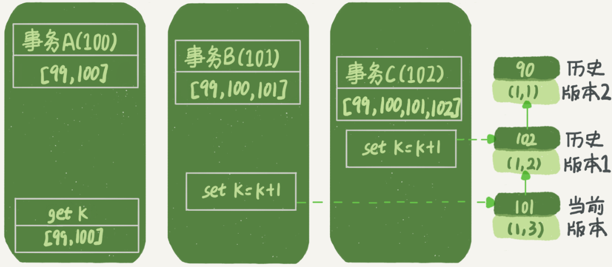

- [MySQL 事务的隔离实现原理](#mysql-事务的隔离实现原理)
  - [1 . 多版本并发控制 ( MVCC )](#1--多版本并发控制--mvcc-)
  - [2. 快照在 MVCC 中如何实现的？](#2-快照在-mvcc-中如何实现的)
    - [2.1 一致性读视图](#21-一致性读视图)
    - [2.2 更新逻辑](#22-更新逻辑)
  - [3 . 锁定读和一致性非锁定读](#3--锁定读和一致性非锁定读)

# MySQL 事务的隔离实现原理

以下是创建一个表 `t`：

```mysql
mysql> CREATE TABLE `t` (
  `id` int(11) NOT NULL,
  `k` int(11) DEFAULT NULL,
  PRIMARY KEY (`id`)
) ENGINE=InnoDB;
insert into t(id, k) values(1,1),(2,2);
```

三个事务 `A, B, C` 的执行流程：




## 1 . 多版本并发控制 ( MVCC )

`MVCC` 是 `InnoDB` 的事务型隔离级别下的一种增强并发性的强大技术。它使得事务在执行一致性读操作有了保证。即，在不同的事务隔离级别下，保证可以正确地读取表中数据。

每个事务都有唯一`ID`，所以，在事务地并发执行过程中，数据表中的一行数据也有多个版本。每次事务进行更新数据时，都会生成一个新的版本数据，并且把事务的 `transaction id` 赋值给这个数据版本的事务 `ID`，记为 `row trx_id`。这样就形成了一行数据的多版本形式。如下图所示，就是一行记录被多个事务更新后的状态：



>   图中虚线框是同一行数据的 4 个版本，当前最新版本是 V4，k 的值是 22，它是被 `transaction id` 为 25 的事务更新的，因此它的版本号是 `row trx_id` 为 25。

更重要的一点是，语句更新会生成 `undo log` ( 回滚日志 )，那么 `undo log` 在哪？

实际上，上图中的三个虚线箭头( `U1, U2, U3`)，就是 `undo log`；而 `V1, V2, V3` 并不是物理上真实存在的，而是每次需要的时候根据当前版本和 `undo log` 推算出来的。例如，需要`V2` 的状态，就是通过`V4`依次执行 `U3, U2` 算出来的。


## 2. 快照在 MVCC 中如何实现的？

### 2.1 一致性读视图

`InnoDB` 引擎中为每个事务构造了一个数组，用来保存这个事务启动瞬间，当前正在 "活跃" 的所有事务 `ID`，"活跃" 指的是，启动了但还没提交的事务。

数组中事务 `ID` 的最小值记为「低水位」，当前系统里已经创建过的事务 `ID` 的最大值加 1 记为「高水位」。

这个视图数组和高水位，就组成了当前事务的「一致性读视图」 ( `consistent read view`)。`InnoDB` 在实现 `MVCC` 时用到的一致性读视图，用于支持「读提交」和「可重复读」隔离级别的实现。

如下图所示为数据版本的可见性规则：


而数据版本的可见性规则，就是基于数据的 `row trx_id` 和事务的一致性视图的对比结果得到的。

这个视图数组把所有的 `row trx_id` 分成了几种不同的情况。这样，对于当前事务的启动瞬间来说，一个数据版本的 `row trx_id`，有以下几种可能：

-   如果落在绿色区域，表示这个版本是已提交的事务或当前事务自己生成的，这个数据是可见的；
-   如果落在红色区域，表示这个版本是由将来启动的事务生成的，是肯定不可见的；
-   如果落在黄色区域，那就包含两种情况：
    1.  若 `row trx_id` 在数组中，表示这个版本是由还没提交的事务生成的，不可见；
    2.  若 `row trx_id` 不在数组中，表示这个版本是已经提交了的事务生成的，可见。

因此，`InnoDB` 引擎就是利用了 "所有数据都有多个版本" 的这个特性，实现了 "秒级创建快照" 的能力。

基于以上分析，在「可重复」隔离级别下，事务 `A` 执行语句返回的结果为 1。这里做以下假设：

1.  事务 `A` 开始前，系统里面只有一个活跃事务 ID 是 99；
2.  事务` A、B、C` 的版本号分别是 100、101、102，且当前系统里只有这四个事务；
3.  三个事务开始前，(1,1）这一行数据的 `row trx_id` 是 90。

这样，事务 `A` 的视图数组就是 `[99,100]`，事务 `B` 的视图数组是 `[99,100,101]`，事务 `C` 的视图数组是` [99,100,101,102]`。

为了简化分析，只画出跟事务 `A` 查询逻辑有关的操作：

  

现在事务 A 要来读数据了，它的视图数组是 [99,100]。当然了，读数据都是从当前版
本读起的。所以，事务 A 查询语句的读数据流程是这样的：

>   找到 (1,3) 的时候，判断出 `row trx_id=101`，比高水位大，处于红色区域，不可见；
>   接着，找到上一个历史版本，一看 `row trx_id=102`，比高水位大，处于红色区域，不可
>   见；
>   再往前找，终于找到了（1,1)，它的 `row trx_id=90`，比低水位小，处于绿色区域，可
>   见。  

这样执行下来，虽然期间这一行数据被修改过，但是事务 `A` 不论在什么时候查询，看到这行数据的结果都是一致的，所以我们称之为「一致性读」。  

上面的判断规则是基于代码逻辑的，一个等价性判断原则如下：

-   版本未提交，不可见；
-   版本已提交，但是在视图数组创建后提交的，不可见；
-   版本已提交，但是在视图数组创建前提交的，可见。

### 2.2 更新逻辑

更新数据都是先读后写的，而这个读，只能是 "当前读"。
因此，在事务 `B` 在更新的时候，当前读拿到的数据是 (1，2)，更新之后数据就成了 (1，3)，这个数据的新版本 `row trx_id` 是 101。否则，当它要去更新数据的时候，如果在历史版本上更新了，那么事务 `C` 的更新就丢失了。因此，事务 `B` 此时的 `set k=k+1` 是在（1，2）的基础上进行的操作。
普通的 `select` 语句是快照读，而 `update, intert` 等命令是当前读。而加锁的 `select` 语句执行的是当前读。如以下两个命令：

`select k from t where id=1 lock in share mode;`
`select k from t where id=1 for update; `

「可重复读」的核心就是一致性读（consistent read）；而事务更新数据的时候，只能用当前读。如果当前的记录的行锁被其他事务占用的话，就需要进入锁等待。
而在「读提交」隔离级别下，每一个语句执行前都会重新算出一个新的视图。  

## 3 . 锁定读和一致性非锁定读

锁定读：一个事务中，默认的 `select` 语句执行的是快照读，读的是数据库的快照版本，是不加锁的。
但是有两个例外情况：**`select ... lock in share mode`** 和 **`select ... for update`** 。

`select ... lock in share mode` ：给表或记录加共享锁，其他事务只能读不能修改，直至当前事务提交；
`select ... for update` ：给记录加排他锁，和 `update` 、`delete` 等操作一样的加锁规则。

因此，当执行上述两个 `select` 语句时，执行的是当前读，读取数据库中对应记录的最新版本。

一致性非锁定读：`InnoDB` 用多版本来提供查询数据库在某个时间点的快照。默认 `select` 读操作就是一致性非锁定读。

