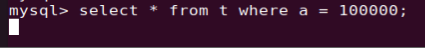
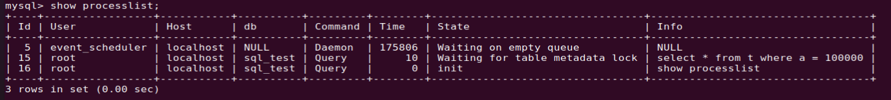
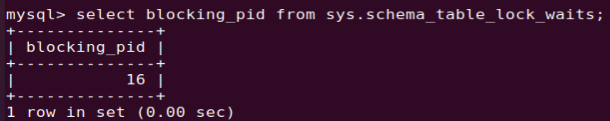
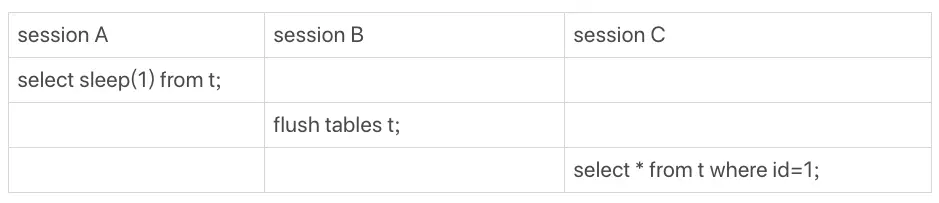
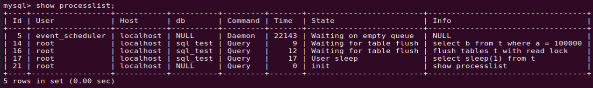
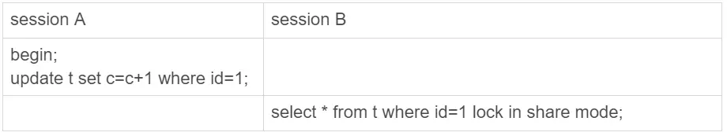
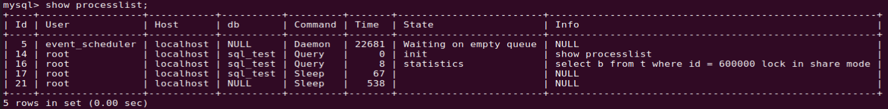
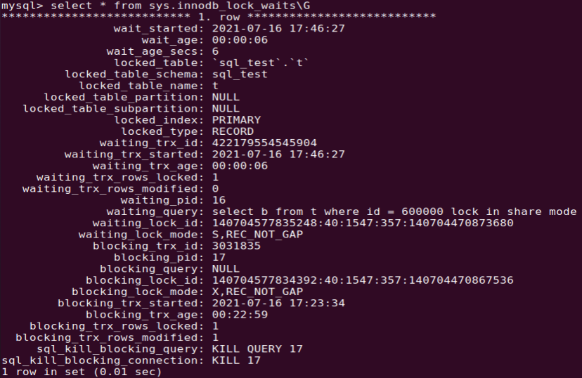
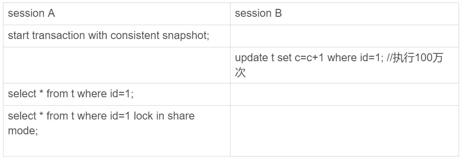

- [MySQL 查询一行数据，为什么这么慢？](#mysql-查询一行数据为什么这么慢)
  - [1. 查询长时间不返回](#1-查询长时间不返回)
    - [1.1 等 MDL 写锁](#11-等-mdl-写锁)
    - [1.2  等 flush](#12--等-flush)
      - [a. `flush tables` 语法](#a-flush-tables-语法)
      - [b. 复现场景](#b-复现场景)
    - [1.3 等行锁](#13-等行锁)
  - [2. 查询慢](#2-查询慢)
# MySQL 查询一行数据，为什么这么慢？

[MySQL实战19讲](https://time.geekbang.org/column/article/74687)

有些情况下，我们查询一行数据，但是执行非常慢。以下是几类出现的现象。

## 1. 查询长时间不返回

在一个表中查询一行数据，但是执行语句长时间不返回。如下：执行语句 `select * from t where a = 10000`；

这种情况下，表 `t` 基本上是被锁住了。可以执行 `show processlist` 命令查看当前语句处于什么状态，如下：

### 1.1 等 MDL 写锁

从上图中可以看出，语句 `select * from t where a = 10000` 处于 `Waiting for table metadata lock` 的状态，这个状态表示当前执行语句在等 `MDL` 写锁时被阻塞，即现在有一个线程在请求或持有 `MDL` 写锁。

复现场景如下：

`session A` 通过命令 `lock table` 持有表 `t` 的 `MDL` 写锁，而 `session B` 的查询需要获取 `MDL` 读锁，所以执行时被阻塞了。 
可以通过命令查看 `sys.schema_table_lock_waits` 这张表 ，找出造成阻塞的 `process id`，把这个连接用 `kill` 命令断开即可。

### 1.2  等 flush

`flush` 语句可以清除或重载各种内部缓存、刷新表或获取锁。

#### a. `flush tables` 语法

`MySQL` 中对表 `flush` 操作的用法有以下两种方法：

`flush tables with read lock` ： 关闭所有打开的表并使用**全局读锁**锁定所有数据库的所有表，并且会清理缓存。
`flush tables t with read lock` ：表示在指定的表 `t` 上进行 `flush` 操作。

#### b. 复现场景

`flush` 语句正常执行起来都很快，所以，出现 `Waiting for table flush` 状态的可能情况是：有一个 `flush tables` 命令被别的语句阻塞了，然后它又阻塞了接下来的执行语句。复现情况如下：

>   在 `session A` 中，故意每行都调用一次 `sleep(1)`，这样这个语句默认要执行 10 万秒，在这期间表 t 一直是被 `session A` "打开" 着。然后，`session B` 的 `flush tables t` 命令再要去关闭表 `t`，就需要等 `session A` 的查询结束。这样，`session C` 要再次查询的话，就会被 `flush` 命令堵住了。

命令 `show processlist` 的查询结果如下：

 

### 1.3 等行锁

当执行加读锁的 `select` 语句时：`select * from t where id=1 lock in share mode;` 
如果这个时候一个事务在该行记录上持有一个写锁，则这个 `select` 语句会被阻塞。如下场景：

 

命令 `show processlist` 的查询结果如下：

如何查出哪个线程占用这个锁，可以通过 `sys.innodb_lock_waits` 表查出。如下：

运行 `kill 17` 就可以断开这个线程，从而使得当前被阻塞的执行语句可以执行。

## 2. 查询慢

`select` 执行语句查询时间可能很慢。例如下面两个语句的执行过程：

`select * from t where id=1;` 一致性读，是快照读，不加锁。
`select * from t where id=1 lock in share mode;` 是当前读

