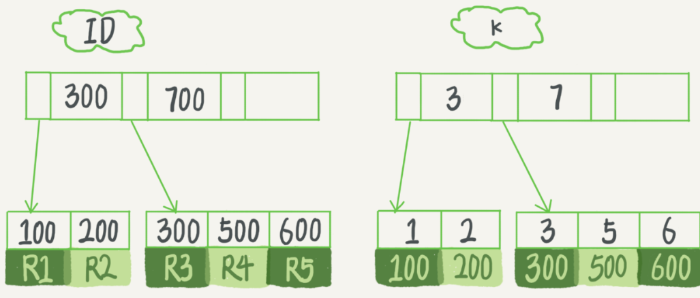

# MYSQL 索引的知识

- [MYSQL 索引的知识](#mysql-索引的知识)
  - [1. SQL 索引](#1-sql-索引)
  - [2. B+Tree 原理](#2-btree-原理)
  - [3. MySQL 的实现方式](#3-mysql-的实现方式)
  - [4. InnoDB 引擎的索引模型](#4-innodb-引擎的索引模型)
    - [4.1 B+Tree 索引模型](#41-btree-索引模型)
    - [4.2 基于主键的索引和辅助索引的查询有什么区别？](#42-基于主键的索引和辅助索引的查询有什么区别)
    - [4.3 覆盖索引](#43-覆盖索引)
  - [5. 创建索引](#5-创建索引)

## 1. SQL 索引

索引是一种提高 SQL 数据查询效率的一种数据结构，就像书的目录一样，即对于数据库中的表而言，索引就是它的 "目录"。

## 2. B+Tree 原理

1. 数据结构

    B-Tree 指的是 Balance Tree，即平衡树。平衡树是一颗查找树，并且所有叶子节点均位于同一层；

    B+Tree 是基于 B-Tree 和叶子结点顺序访问指针实现的。它具有 B-Tree 的平衡性，并且可以通过顺序访问指针来提高区间查询性能；

2. 操作

    进行查找操作时，首先在根节点进行二分查找，找到一个 key 对应的指针，然后递归地在指针所指向的节点进行查找，直到查到叶子结点。然后在叶子结点上进行二分查找，找到 key 所对应的文件记录。

    插入和删除操作会破坏平衡树的结构，因此在插入和删除操作后，需要对树进行分裂、合并、旋转等操作来维护平衡性。

3. 与红黑树的不同

    红黑树也是一种平衡树，可以用来索引。但是文件系统和数据库系统普遍采用 B+Tree 作为索引结构，这是因为使用 B+Tree 访问磁盘数据有更高的性能；

    - **B+Tree 有更低的树高**

        平衡树的树高一般为 O(h) = O($\log_dN$)，d 为每个节点的出度。红黑树的出度为 2，B+Tree 的出度一般较大，所以 B+Tree 的树高较低。

    - **磁盘访问原理**

        OS 一般将内存和磁盘分割成固定大小的块，每一块称为一页。内存和磁盘以页为单位交换数据。数据库系统将索引的一个节点的大小设置为页的大小，使得一次 I/O 操作就可以载入一个节点信息。如果数据不在一个磁盘块上，那么需要磁盘的制动手臂进行寻道。为了节约磁盘数据读取时间，B+Tree 相对于红黑树有更低的树高，磁盘寻道的次数和树高成正比，读取相同的磁盘块数据就只需更短的磁盘旋转时间，所以 B+Tree 更适合作为磁盘的索引结构。

## 3. MySQL 的实现方式

在存储引擎层实现，不同存储引擎具有不同的索引类型和实现。


1. B+Tree 索引：最常见的索引，大多数引擎都支持 B+Tree 索引；MySQL 5.5 版本后存储引擎默认为 InnoDB 引擎。

    InnoDB 的 B+Tree 索引分为主索引和次索引。主索引的叶子节点 `data` 域记录着完整的数据记录，这种索引方式被称为聚簇索引。因为无法把数据行存放在两个位置，所以一个表中只有一个聚簇索引。辅助索引的叶子节点的 `data` 域记录着主键的值，因此在使用辅助索引进行查询时，需要先找到主键值，然后到主索引中查找完整数据。

2. HASH 索引：只有 Memory 引擎支持，使用场景简单；

    哈希索引能以 O(1) 的时间进行查找，但是失去了有序性：

    - 无法用于排序与分组；
    - 只支持精确查找，无法用于部分查找和范围查找；

3. R-Tree 索引(空间索引)：是 MyISAM 的一种特殊索引类型，主要用于地理空间数据类型；

4. Full-text(全文索引)：也是 MyISAM 的一种特殊索引类型，InnoDB 现在也支持全文索引；

## 4. InnoDB 引擎的索引模型

在 InnoDB 中，表都是根据主键顺序以索引形式存放的，这种存储方式的表称为索引组织表。InnoDB 使用了 B+Tree 索引模型，所以数据都是存在 B+Tree 中的。

### 4.1 B+Tree 索引模型

```mysql
mysql> create table T(
id int primary key,
k int not null,
name varchar(16),
index (k))engine=InnoDB;

mysql> INSERT INTO T( id, k, name )
values( 100, 1 );

mysql> INSERT INTO T( id, k, name )
values( 200, 2 );

mysql> INSERT INTO T( id, k, name )
values( 300, 3 );

mysql> INSERT INTO T( id, k, name )
values( 500, 5 );

mysql> INSERT INTO T( id, k, name )
values( 600, 6 );
```

表中 `R1~R5` 的 `(id, k)` 值分别为 `(100,1)、(200,2)、(300,3)、(500,5) 和 (600,6)`，两棵树的索引结构示例示意图如下:

  

从以上图中可知，根据叶子节点的内容，索引模型可以分为 **主键索引** 和 **辅助索引**。

主键索引的叶子节点存的是整行数据，在 InnoDB 中也称为聚簇索引。

辅助索引的叶子节点存的是主键的值。

### 4.2 基于主键的索引和辅助索引的查询有什么区别？

如果使用语句 `select * from T WHERE id = 500`，即主键查询方式，则只需要搜索 ID 这棵 B+ 树。

但如果使用 `select * from T WHERE k = 5`，即普通索引查询方式，则需要先搜索 k 这棵索引树，找到对应的 id 为 500 后， 然后在 id 这个树上再查找一次。

**回到主键索引树搜索的这个过程称为回表。**

### 4.3 覆盖索引

如果执行的语句是 `select id form T WHERE k between 3 and 5`，此时只需查询 `id` 的值，而 `id` 的值已经在 `k` 索引树上了，因此可以直接提供查询结果，不需要回表。在这个查询过程中，索引 `k` 已经 "覆盖" 了我们的查询要求，因此，称为 **覆盖索引**。

覆盖索引可以减少树的搜索次数，显著提升查询性能，因此，使用覆盖索引是一个常用的性能优化手段。

## 5. 创建索引

```mysql
create index prod_name_ind on Products (prod_name); -- 在表 Products 中的列 prod_name 上创建索引名 prod_name_ind
