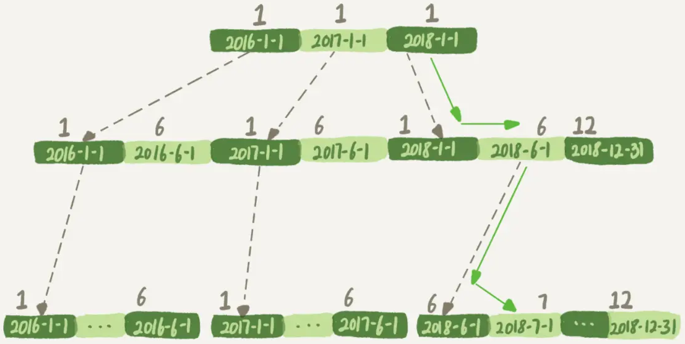

- [MySQL 语句执行优化](#mysql-语句执行优化)
  - [1. 为什么 SQL 语句逻辑相同，执行性能却差距这么大？](#1-为什么-sql-语句逻辑相同执行性能却差距这么大)
    - [1.1 条件字段做函数操作](#11-条件字段做函数操作)
      - [a. 问题场景](#a-问题场景)
      - [b. 原因分析](#b-原因分析)
    - [1.2 隐式类型转换](#12-隐式类型转换)
      - [a. 问题场景](#a-问题场景-1)
    - [1.3 隐式字符编码转换](#13-隐式字符编码转换)

# MySQL 语句执行优化

[ MySQL 实战第18讲](https://time.geekbang.org/column/article/74059)

## 1. 为什么 SQL 语句逻辑相同，执行性能却差距这么大？

在 `MySQL` 中，许多看上去逻辑相同的执行语句，但对这些语句执行不当的话，就会影响数据库的性能。以下是几个具体案例。

### 1.1 条件字段做函数操作

#### a. 问题场景

在一个交易系统中，其中的交易记录表中 (`tradelog` ) 包括交易流水号 ( `tradeid` ) 、交易员 ( `operatorid` ) 、交易时间 ( `t_modified` ) 等字段。这个表的结构如下：

```mysql

mysql> CREATE TABLE `tradelog` (
  `id` int(11) NOT NULL,
  `tradeid` varchar(32) DEFAULT NULL,
  `operatorid` int(11) DEFAULT NULL,
  `t_modified` datetime DEFAULT NULL,
  PRIMARY KEY (`id`),
  KEY `tradeid` (`tradeid`),
  KEY `t_modified` (`t_modified`)
) ENGINE=InnoDB DEFAULT CHARSET=utf8mb4;
```

假设表中存储了从 `2016` 年初到 `2018` 年末的所有数据，那么如果要统计所有年份中 `7` 月份的交易记录总数，此时 `SQL` 语句可能写法如下：
`select count(*) from tradelog where month(t_modified) = 7`。
由于 `t_modified` 字段上有索引，所以你放心地执行了这条语句，但发现语句执行了好久。原因何在？

#### b. 原因分析

**因为在索引字段上做函数操作，这时 `MySQL` 就用不上索引了，就不能快速定位所需要的数据了，只能做全盘扫描。**

进一步思考：为什么执行语句用不了索引？ 字段 `t_modified` 的索引结构如下：



因为在索引字段 `t_modified` 上用了 `month()` 函数，这个函数返回给定日期的具体月份。在求指定月份时，在索引树的第一层，优化器就不知道如何操作了。
`B+` 树提供的快速定位能力，是基于同一层节点的有序性。而 `SQL` 语句条件用的是 `where t_modified = '2018-7-1'`，就可以走 `t_modifity` 索引树了。

因此，当在索引字段上做函数操作，可能破坏索引值的有序性，此时优化器会放弃走树搜索的功能。
正确语句应该如下：（统计所有年份中月份为 `7` 月的交易总数）

```mysql

mysql> select count(*) from tradelog where
    -> (t_modified >= '2016-7-1' and t_modified<'2016-8-1') or
    -> (t_modified >= '2017-7-1' and t_modified<'2017-8-1') or 
    -> (t_modified >= '2018-7-1' and t_modified<'2018-8-1');
```

### 1.2 隐式类型转换

#### a. 问题场景

如下一条执行语句：
`select * from tradelog where tradeid = 10001`；

因为 `tradeid` 是 `varchar` 类型，而输入参数是整型的，所以需要做参数转换。当字符串类型和整数类型做比较时，`MySQL` 会把字符串类型转为整型。
所以，在字段 `tradeid` 上 要做类型转换，如下：

```mysql
select * from tradelog where CAST(tradid AS signed int) = 110717;
```

这个场景下，该执行语句也是在索引字段上做函数操作，优化器会放弃走树搜索功能，改成全索引扫描。

### 1.3 隐式字符编码转换

当两个数据表进行连接时，由于两个表的字符编码不同，则可能会导致相关的 `SQL` 执行语句的性能下降。

