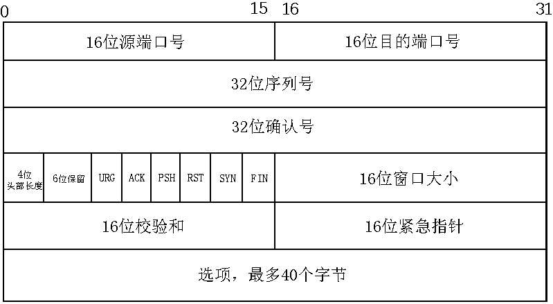

# TCP协议

## 1. TCP协议头部结构

TCP头部结构如下：

-   16位端口号：告知主机该报文段来着哪里(源端口)以及传给哪个上层协议或应用程序(目的端口)。知名服务的端口号定义在/etc/services文件中。

-   32位序列号：一次TCP通信(从TCP连接建立到断开)过程中某一个传输方向上的字节流的每个报文段的编号。

    假设，主机A与主机B建立TCP通信，A发送给B的第一个TCP报文段中，序号值被系统初始化为某个随机值(ISN)。此后，在该传输方向上(A--->B)，后续的TCP报文段的序号值将是ISN+该报文段携带数据的第一个字节在整个字节流中的偏移。例如，某个TCP报文段中传送的数据是字节流第1025~2048字节，那么整个报文段的序号即为ISN+1025。同理，从B到A传输方向也是相同的编号规则。

-   32位确认号：用作另一方发送来的TCP报文段的响应。

    其值是收到TCP报文段的序号值加1。例如，在上面的阐述中，当B给A发送TCP报文段时，这个发出的报文段同时也携带自己的序列号和对A发送来的报文段的确认号(ISN+1025+1)。

-   4位头部长度：标识TCP头部的大小。4bits最大表示值为15，故TCP头部最长可为60个字节。

-   6位标记位含义如下：
    -   URG：标记紧急指针是否有效；
    -   ACK：表示确认号是否有效；携带ACK标记位的TCP报文段也称**确认报文段**；
    -   PSH：接收端应用程序应该立即从TCP接受缓冲区中读走数据，为接受后续数据腾出空间。
    -   RST：要求对方关闭连接或重新建立连接，表示复位报文段；
    -   SYN：表示请求建立一个连接。携带SYN标记位的TCP报文段也称**同步报文段**；
    -   FIN：表示通知对方本端要关闭连接了。携带FIN报文段的报文也称**结束报文段**；

-   16位窗口大小：TCP流量控制的一个手段。这里的窗口是指接收通告窗口。它告诉对端，本端的TCP接收缓冲区还能接收多少字节的数据，这样接收方就可以控制发送方的发送数据的速度。

-   16位校验和：由发送端填充，接收端对TCP报文段执行CRC算法以校验TCP报文段在传输过程中是否损坏。这是TCP可靠传输的一个重要保障。

## 2. TCP三次握手

TCP三次握手流程图：

-   客户端通过connect系统调用主动与服务器建立连接。connect首先向服务器发送一个SYN报文段，使连接转移为SYN_SENT状态；

-   服务端在收到客户端的请求连接后，发送同步和确认报文段给客户端，这时服务端连接转移为SYN_RCVD状态；

-   如果客户端成功接收到服务器的同步和确认报文段，connect系统调用成功返回，则此时连接转移为ESTABLISHED；

-   服务端收到客户端的确认报文段后，则其连接转移为ESTABLISHED。至此，客户端与服务端通过三次握手建立可靠连接，可以进行通信。

## 3. TCP四次挥手

TCP四次挥手流程图：

-   客户端执行主动关闭后，此时它向服务端发送一个带FIN标志位的结束报文段，同时进入FIN_WAIT_1状态；
-   若客户端收到服务端专门用于确认目的的确认报文段，则客户端连接转移为FIN_WAIT_2状态；服务端则进入CLOSE_WAIT状态；
-   服务端发送结束报文段后，则此时服务器连接转移LAST_ACK状态。客户端在收到服务端发送的结束报文段后，并同时发送确认报文段，然后进入TIME_WAIT状态；
-   客户端在进入TIME_WAIT状态后，等待**2MSL**的时间后，彻底关闭连接。服务端收到客户端发来的确认报文段后，也彻底关闭连接。

>   MSL(max segment life):报文段最大生存时间，TCP报文在网络中的最大生存时间。

TIME_WAIT状态存在的理由：

-   可靠地终止TCP连接；
-   保证让延迟的报文有足够的时间被识别并丢弃；

坚持2MSL时间的原因是能够保证网络上两个传输方向上尚未被接收到的、迟到的TCP报文段都已消失。防止应用程序立即建立一个和刚关闭的连接相似的新连接(称为原来连接的化身)。这个新的化身可能接受到属于原来连接的TCP报文段。

>   连接相似：新连接和原来的连接使用相同的ip和端口号

处于TIME_WAIT状态下连接占用的端口通常是不可以立即被再次使用的，需要等待2MSL后客户端完全释放后才可以重新使用该端口。

若服务端主动关闭连接后异常终止，那么可以设置socket选项中的SO_REUSEADDR来强制进程立即使用处于TIME_WAIT状态的连接占用的端口。