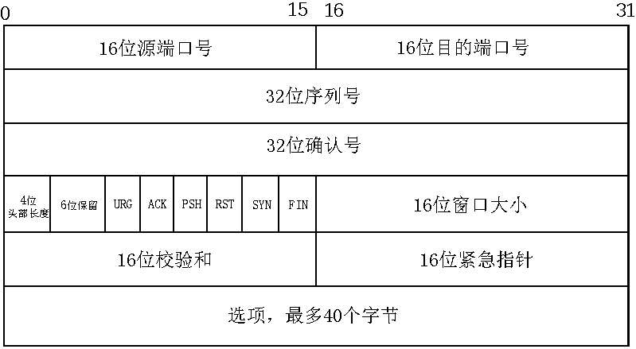

# `TCP`协议

## 1. `TCP`协议头部结构

`TCP`头部结构如下：

-   `16`位端口号：告知主机该报文段来着哪里(源端口)以及传给哪个上层协议或应用程序(目的端口)。知名服务的端口号定义在`/etc/services`文件中。

-   `32`位序列号：一次`TCP`通信(从`TCP`连接建立到断开)过程中某一个传输方向上的字节流的每个报文段的编号。

    > 假设，主机`A`与主机`B`建立`TCP`通信，`A`发送给`B`的第一个`TCP`报文段中，序号值被系统初始化为某个随机值(`ISN`)。此后，在该传输方向上(`A-->B`)，后续的`TCP`报文段的序号值将是`ISN`+该报文段携带数据的第一个字节在整个字节流中的偏移。例如，某个`TCP`报文段中传送的数据是字节流第`1025~2048`字节，那么整个报文段的序号即为`ISN+1025`。同理，从`B`到`A`传输方向也是相同的编号规则。

-   32位确认号：期望下一次收到的序列号，用作另一方发送来的`TCP`报文段的响应。

    其值是收到`TCP`报文段的序号值加`1`。例如，在上面的阐述中，当`B`给`A`发送`TCP`报文段时，这个发出的报文段同时也携带自己的序列号和对`A`发送来的报文段的确认号(`ISN+1025+1`)。

-   `4`位头部长度：标识`TCP`头部的大小。`4bits`最大表示值为`15`，故`TCP`头部最长可为`60`个字节。

-   `6`位标记位含义如下：
    
    -   `URG`：标记紧急指针是否有效；
    -   `ACK`：表示确认号是否有效；携带`ACK`标记位的`TCP`报文段也称 **确认报文段**；
    -   `PSH`：接收端应用程序应该立即从`TCP`接受缓冲区中读走数据，为接受后续数据腾出空间。
    -   `RST`：要求对方关闭连接或重新建立连接，表示复位报文段；
    -   `SYN`：表示请求建立一个连接。携带`SYN`标记位的`TCP`报文段也称 **同步报文段**；
    -   `FIN`：表示通知对方本端要关闭连接了。携带`FIN`报文段的报文也称 **结束报文段**；
    
-   `16`位窗口大小：`TCP`流量控制的一个手段。这里的窗口是指接收通告窗口。它告诉对端，本端的TCP接收缓冲区还能接收多少字节的数据，这样接收方就可以控制发送方的发送数据的速度。

-   `16`位校验和：由发送端填充，接收端对`TCP`报文段执行`CRC`算法以校验`TCP`报文段在传输过程中是否损坏。这是`TCP`可靠传输的一个重要保障。

## 2. TCP三次握手

### 2.1 TCP三次握手流程图

-   客户端通过`connect`系统调用主动与服务器建立连接。`connect`首先向服务器发送一个`SYN`报文段，使其连接转移为`SYN_SENT`状态；

-   服务端在收到客户端的请求连接后，发送同步和确认报文段给客户端，这时服务端连接转移为`SYN_RCVD`状态（半连接队列）；

-   如果客户端成功接收到服务器的同步和确认报文段，`connect`系统调用成功返回，则此时连接转移为`ESTABLISHED`；

-   服务端收到客户端的确认报文段后，则其连接转移为`ESTABLISHED`（全连接队列）。至此，客户端与服务端通过三次握手建立可靠连接，可以进行通信。

### 2.2 要点

1. `TCP` 三次握手的连接过程中，`Linux` 中会保持两个队列：
   1. 半连接队列，也称 `SYN` 队列；
   2. 全连接队列，也称 `accept` 队列；
2. `ACK` 报文不占用序列号；
3. `Linux` 中查看 `TCP` 连接状态命令：`netstat -napt`；

## 3. TCP四次挥手

TCP四次挥手流程图：

-   客户端执行主动关闭后，此时它向服务端发送一个带FIN标志位的结束报文段，同时进入`FIN_WAIT_1`状态；
-   若客户端收到服务端专门用于确认目的的确认报文段，则客户端连接转移为`FIN_WAIT_2`状态；服务端则进入`CLOSE_WAIT`状态；
-   服务端发送结束报文段后，则此时服务器连接转移`LAST_ACK`状态。客户端在收到服务端发送的结束报文段后，并同时发送确认报文段，然后进入`TIME_WAIT`状态；
-   客户端在进入`TIME_WAIT`状态后，等待**`2MSL`**的时间后，彻底关闭连接。服务端收到客户端发来的确认报文段后，也彻底关闭连接。

>   `MSL`(`max segment life`):报文段最大生存时间，`TCP`报文在网络中的最大生存时间。

`TIME_WAIT`状态存在的理由：

-   可靠地终止`TCP`连接；
-   保证让延迟的报文有足够的时间被识别并丢弃；

坚持`2MSL`时间的原因是能够保证网络上两个传输方向上尚未被接收到的、迟到的`TCP`报文段都已消失。防止应用程序立即建立一个和刚关闭的连接相似的新连接(称为原来连接的化身)。这个新的化身可能接受到属于原来连接的`TCP`报文段。

>   连接相似：新连接和原来的连接使用相同的`ip`和端口号

处于TIME_WAIT状态下连接占用的端口通常是不可以立即被再次使用的，需要等待`2MSL`后客户端完全释放后才可以重新使用该端口。

若服务端主动关闭连接后异常终止，那么可以设置`socket`选项中的`SO_REUSEADDR`来强制进程立即使用处于`TIME_WAIT`状态的连接占用的端口。

