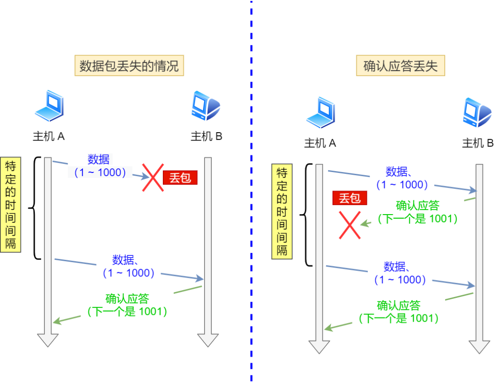
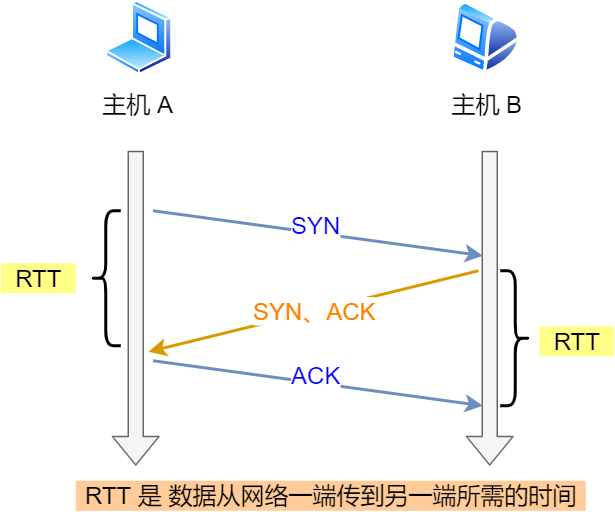
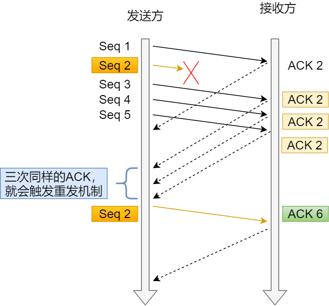

- [TCP 传输如何保证可靠性传输](#tcp-传输如何保证可靠性传输)
  - [1. 重传机制](#1-重传机制)
    - [1.1 超时重传](#11-超时重传)
      - [a. 超时间隔](#a-超时间隔)
    - [1.2 快速重传](#12-快速重传)
    - [1.3 `SACK`](#13-sack)
    - [1.4 `D-SACK`](#14-d-sack)
  - [3. 校验和：保证数据的准确性；](#3-校验和保证数据的准确性)
  - [4. 流量控制：控制发送方](#4-流量控制控制发送方)
  - [5. 拥塞控制：控制网络](#5-拥塞控制控制网络)
# TCP 传输如何保证可靠性传输

## 1. 重传机制

`TCP` 通过 **序列号** 和 **确认号** 确保数据传输的可靠性。在 `TCP` 中，当发送端的数据到达接收端时，接收端就会回复一个确认应答消息，表示已收到信息。
但是在错综复杂的网络中，数据的传输可能出现异常情况。当某个数据包丢失后，`TCP` 会用重传机制解决。
重传机制有以下常见的方式：

- 超时重传
- 快速重传
- `SACK` ( 选择性确认 )
- `D-SACK`

### 1.1 超时重传
发送方在发送数据后，就启动一个定时器。当超过指定的时间，没有收到接收方的确认应答报文，就会重传该数据。
`TCP` 在以下两种情况发生超时重传：
- 数据包丢失；
- 确认应答报文丢失。

#### a. 超时间隔
首先，一个数据包的往返时延用 `RTT`( `Round Trip Time` ) 表示，指的是数据包从发出到它被确认应答的时间。

而超时重传是以 `RTO` ( `Retransmission Timeout` ) 表示的。

**`RTO` 的值应该略大于 `RTT` 的值**，可让重传机制更高效。而且，这两个值是 **动态变化** 的。

虽然，超时重传机制可以保证数据传输的可靠性，但是超时间隔可能相对较长，就会导致网络传输效率较低。

### 1.2 快速重传
针对超时重传存在的问题，快速重传不以时间为驱动，而以数据驱动重传。
快速重传机制如下：

> 上图中，发送方连续发送 `1,2,3,4,5` 份数据：
> 1. 第一份数据 `Seq1` 被收到了，接收方回复 `ACK 2`；
> 2. `Seq2` 丢失，接着又发送 `Seq3` 数据，此时回复 `ACK 2`；
> 3. `Seq4, Seq5` 也被确认收到，但仍回复 `ACK 2`；
> 4. 由于接收方连续三次收到相同的确认号 `ACK 2`，在超时间隔过期前，发送方就会重传 `Seq2` 报文；
> 5. 最后，`Seq2` 被收到了，此时因为 `Seq3, 4, 5` 都被收到，就回复 `ACK 6`。

所以，快速重传机制是当收到三个相同的确认报文时，在定时器过期前，就会重传丢失的报文段。
但是，对于上述的例子，发送方并不知道 `ACK 2` 的确认报文是谁传回的，所以就有了 `SACK` 方法。

### 1.3 `SACK`

`SACK` （`Selective Acknowledgement`）：选择性确认。

### 1.4 `D-SACK`

## 3. 校验和：保证数据的准确性；

​	在数据传输过程中，将发送的数据段当做一个16位的整数。将这些整数加起来，如有进位则补在最后，最后全部取反，得到校验和。

## 4. 流量控制：控制发送方

​	流量控制就是让发送方降低发送频率，接收方来得及接收，防止报文分组丢失。原理就是利用TCP报文段中的窗口大小来控制的。

​	实现方法：由**滑动窗口**协议实现。滑动窗口协议既保证了分组无差错、有序接收、也实现了流量控制。主要就是通过应答方返回的ACK报文中含有自己的接受窗口大小，从而利用此窗口大小控制发送方的数据分发窗口大小。

## 5. 拥塞控制：控制网络

​	拥塞控制就是防止网络中注入过多的数据，造成网络负载过大的情况。

​	策略：先发送少量数据探路，再决定以多大的速度进行传输。发送方维持一个**拥塞窗口**(cwnd)的状态变量。窗口的大小取决于网络的拥塞情况，并且在动态变化。

​	拥塞控制的四种算法：慢开始、拥塞避免、快重传、快恢复。

1.  慢开始：慢开始阶段拥塞窗口呈**指数级**增长趋势。为了防止cwnd增长过快引起网络拥塞，还要设置一个慢开始门限ssthresh状态变量，ssthresh用法如下：
    -   cwnd < ssthresh：慢开始算法；
    -   cwnd > ssthresh：拥塞避免算法；
    -   cwnd == ssthresh：慢开始或拥塞避免算法任选；

2.  拥塞避免：拥塞避免算法让拥塞窗口呈**线性增长**趋势。

    当发送方判断网络出现拥塞时，就把慢开始设置的ssthresh值重置为出现网络拥塞时拥塞窗口的一半，并把cwnd重新设置为1，再次执行慢开始算法。

2.  快重传：接收方收到一个失序的报文段后就立即发出重复确认。发送方连续收到3个重复确认就应立即重传缺失的报文段。

3.  快恢复：在发送方判断网络出现拥塞时，也把慢开始设置的ssthresh初值重置为出现网络拥塞时拥塞窗口的一半，也把cwnd重置为被重置后的ssthresh值，不像慢开始算法一样重置为1。

​	

​	

