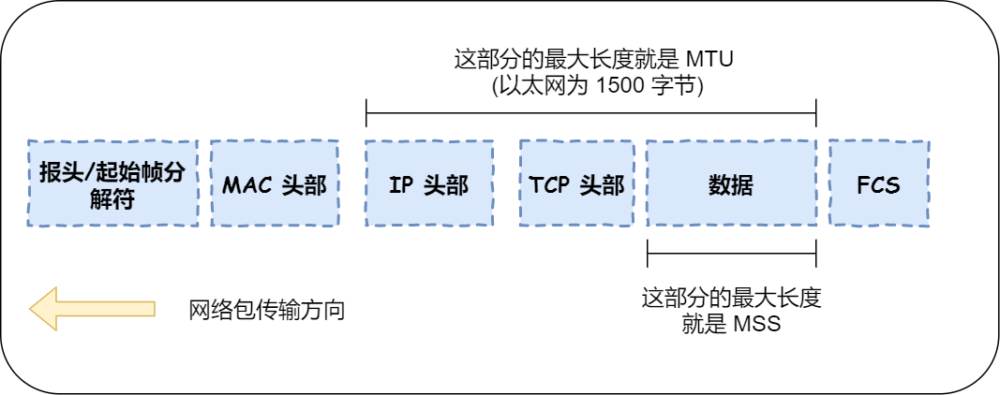

- [TCP 连接问题分析](#tcp-连接问题分析)
  - [1. TCP 连接为什么需要三次握手](#1-tcp-连接为什么需要三次握手)
    - [1.1 防止旧的历史重复连接启动造成混乱](#11-防止旧的历史重复连接启动造成混乱)
    - [1.2 同步初始序列号](#12-同步初始序列号)
    - [1.3 避免资源浪费](#13-避免资源浪费)
  - [2. `TCP` 层为什么需要 `MSS` ？](#2-tcp-层为什么需要-mss-)
  - [3. `SYN` 攻击](#3-syn-攻击)
    - [3.1 定义](#31-定义)
    - [3.2 避免 `SYN` 攻击的方式](#32-避免-syn-攻击的方式)

# TCP 连接问题分析

## 1. TCP 连接为什么需要三次握手

### 1.1 防止旧的历史重复连接启动造成混乱

`RFC 793` 文档中写到最主要的原因是： `The principle reason for the three-way handshake is to prevent old duplicate connection initiations from causing confusion.`，即防止旧的重复连接启动造成混乱。
如下图所示的连接过程：

客户端在发送多个 `SYN` 建立连接的报文时，在 **网络拥堵** 的情况下：

1. 一个旧的「`SYN`报文」比最新的「`SYN`报文」可能提前到达服务端；
2. 服务端回复一个 `SYN + ACK` 报文给客户端；
3. 客户端根据接收后的报文的信息，判断这是一个历史连接（序列号过期或超时），那么客户端就发送 `RST` 报文给服务端，表示终止这一次连接。

如果是两次握手，就不能判断当前连接是否为历史连接，而三次握手则可以让客户端在准备发送第三次报文时，客户端有足够的上下文判断当前连接是否为历史连接：

1. 如果是历史连接，客户端则发送 `RST` 报文，终止这次历史连接；
2. 如果是最新的请求连接，客户端则发送 `ACK` 报文，通信双方就会成功建立连接。

### 1.2 同步初始序列号

`TCP` 协议的双方通信，都必须维护着一个「序列号」，序列号是可靠传输的一个关键因素，它的作用是：
1. 接收方可以去除重复数据；
2. 接收方根据数据包的序列号按序接收；
3. 双方可以确认已发出的包哪些是被对方接收的。

可见，序列号在 `TCP` 连接中占据着非常重要的作用，所以当客户端发送携带「初始序列号」的 `SYN` 报文的时候，需要服务端回一个 `ACK` 应答报文，表示客户端的 `SYN` 报文已被服务端成功接收，那当服务端发送「初始序列号」给客户端的时候，依然也要得到客户端的应答回应，这样一来一回，才能确保双方的初始序列号能被可靠的同步。

### 1.3 避免资源浪费
如果只有两次握手，当客户端的 `SYN` 请求连接报文在网络中阻塞，客户端没有收到 `ACK` 报文，那么客户端就会重发 `SYN` 报文，如果第三次握手，服务端根本不知道客户端是否已经收到自己发送的 `SYN + ACK` 报文，所以，服务端每收到一个连接 `SYN` 报文，就会建立一次连接，这会极大地造成资源的浪费。

## 2. `TCP` 层为什么需要 `MSS` ？

即使 `IP` 层会分片，但是 `TCP` 仍然会根据 `MSS` 的大小对数据包进行分片。
`MTU`：一个网络包的最大长度，以太网中一般是 `1500` 字节；
`MSS`：除去 `IP头部` 和 `TCP头部` 之后，一个网络包所能容纳的 `TCP` 数据的最大长度；
如下图：

 

如果 `TCP` 层的整个网络包不分片，直接传给 `IP` 层分片，那么可能出现什么问题？
在 `IP` 层当数据包大于 `MSS` 时，就会对数据包进行分片，多个数据分片传出后，由目标主机的 `IP` 层进行重组，然后交由上层 `TCP` 层。
如果接收方发现某个数据分片丢失后，则不会响应 `ACK` 报文给对方，那么发送方的 `TCP` 在超时后，就会重传整个 `TCP` 数据包。
因为 `IP` 层不具有超时重传机制，所以只能由 `TCP` 负责超时重传数据包，这种情况下，整个网络包的传输效率很低。

因此，在 `TCP` 建立连接时会协商双方的 `MSS` 长度，如果数据包超过 `MSS` 长度，先进行数据分片，这样也保证了到达 `IP` 层的数据包不会分片。
如果某个数据分片丢失后，`TCP` 层只会重发以 `MSS` 为单位的数据分片，大大地提高了传输效率。

## 3. `SYN` 攻击

### 3.1 定义
攻击者短时间内伪造不同 `IP` 地址 `SYN` 报文，服务端就会响应一个 `SYN + ACK` 报文，就进入 `SYN_RCVD` 状态。但是之后便收不到对方的应答，短时间内服务端的 **半连接队列** 就会被占满，那么就无法为正常用户服务。

### 3.2 避免 `SYN` 攻击的方式

避免 `SYN` 攻击主要由以下两种方式：
1. 解决方法是可以修改内核参数，控制队列大小和当队列满时要进行的操作。
  - `SYN_RCVD` 状态连接的最大个数：`cat /proc/sys/net/ipv4/tcp_max_syn_backlog`；
  - 超过处理能力时，对于新的连接请求，服务端直接发送 `RST` 报文，丢弃连接；

2. 开启 `tcp_syncookies` 设置
在正常情况下，`Linux` 内核的「`SYN`队列」和「 `accept` 队列」是如何工作的？如下所示：

 

> - 当服务端接收到客户端的 `SYN` 报文后，会将其加入「`SYN`队列」中；
> - 接着发送 `SYN + ACK` 报文给客户端，等客户端回应 `ACK` 报文；
> - 服务端收到 `ACK` 报文后，会将客户端将「`SYN`队列」移除到「 `accept` 队列」中；
> - 应用通过调用 `accept()` `socket` 接口，从「 `accept` 队列」取出连接。

当应用程序处理速度过慢时，会出现 「`accept` 队列」已满的情况，如下：

 

因为在接收 `SYN` 包的那个源码里，不仅会判断半连接队列是否会满，也会判断全连接队列是否满了，如果满了就丢掉 `SYN` 报文，不再接收客户端的请求了。

而受到 `SYN` 攻击时，则是 「`SYN` 队列」已满，如下情况：

 

在这种情况下， `tcp_syncookies` 的方式是：`net.ipv4.tcp_syncookies = 1`。以下是处理过程：
- 当 「`SYN` 队列」满之后，后续服务器收到 `SYN` 包，不进入「 `SYN` 队列」；
- 计算出一个 `cookie` 值，再以 `SYN + ACK` 中的「序列号」返回客户端；
- 服务端接收到客户端的应答报文时，服务器会检查这个 `ACK` 包的合法性。如果合法，直接放入到「`accept` 队列」。
- 最后应用通过调用 `accpet() socket` 接口，从「`accept` 队列」取出的连接。

 