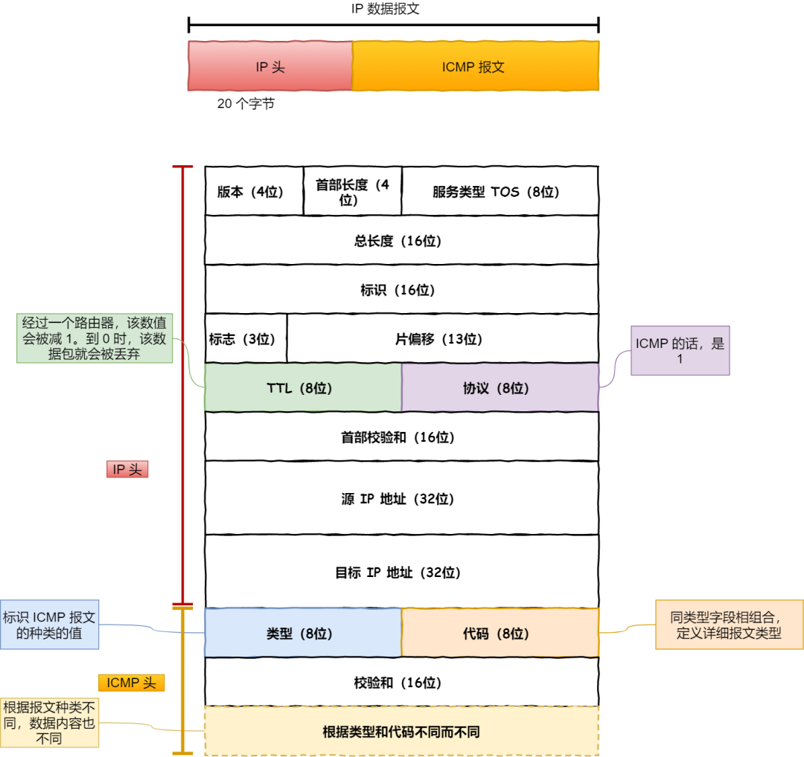

- [ping 命令原理](#ping-命令原理)
  - [1. `ICMP` 协议](#1-icmp-协议)
    - [1.1 `ICMP` 协议格式](#11-icmp-协议格式)
# ping 命令原理

`ping` 命令程序是基于 `ICMP` 协议工作的，它的目的是测试另一台主机是否可达。该程序发送一份 `ICMP` 回显请求报文给目的主机，并等待返回 `ICMP` 回显应答报文。

## 1. `ICMP` 协议

`ICMP` 全称是 `Internet Control Message Protocol`，即互联网控制报文协议。它的功能是：当 `IP` 包在通信过程中由于某种原因未能到达目的主机时，其中的具体原因由 `ICMP` 负责通知返回。
### 1.1 `ICMP` 协议格式
`ICMP` 报文是 `IP` 层的一个组成部分，它工作在网络层，是 `IP` 协议的助手。它的格式如下：

不同类型的 `ICMP` 报文由字段类型和代码共同决定的。`ICMP` 报文根据头部的类型字段分为两类：
1. 用于诊断的查询消息，即「查询报文」；
2. 用于通知出错原因的错误消息，即「差错报文」。

`ICMP` 报文与 `IP` 头部组成的`IP` 数据包格式如下：

