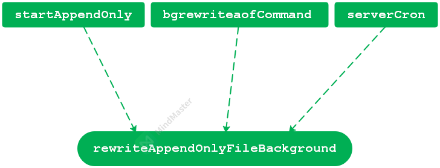

- [`AOF & RDB`](#aof--rdb)
- [1. `AOF` 日志](#1-aof-日志)
  - [1.1 `AOF`持久化实现](#11-aof持久化实现)
    - [1.1.1 命令追加](#111-命令追加)
    - [1.1.2 `AOF`文件的写入与同步](#112-aof文件的写入与同步)
  - [1.2 `AOF`文件的载入和数据还原](#12-aof文件的载入和数据还原)
  - [1.3 `AOF`重写](#13-aof重写)
    - [1.3.1 重写原理](#131-重写原理)
    - [1.3.2 实现方式](#132-实现方式)
    - [1.3.3 重写过程](#133-重写过程)
- [2. `RDB` 快照](#2-rdb-快照)
  - [2.1 `RDB`文件的创建](#21-rdb文件的创建)
  - [2.2 `RDB`文件结构](#22-rdb文件结构)

# `AOF & RDB`

`AOF` 日志和 `RDB` 快照是 `Redis` 中数据持久化的两种方式，保证了 `Redis` 数据库中数据的可靠性。

因为`AOF`文件的更新频率通常比`RDB`文件更新频率高，所以：

1. 如果服务器开始了`AOF`持久化功能，那么服务器会优先使用`AOF`文件来还原数据库状态；
2. 只有在`AOF`持久化功能关闭时，服务器才会使用`RDB`文件来还原数据库状态。

# 1. `AOF` 日志

`AOF` 日志以 "命令+键值对" 的形式来追加记录每个键值对的 **写操作**。主线程在处理客户端的读写需求时，写操作会被主线程正常写入到 `AOF` 日志文件。

## 1.1 `AOF`持久化实现

`AOF`持久化功能的实现可以分为：命令追加、文件写入和文件同步三个步骤。

### 1.1.1 命令追加

当`AOF`持久化功能打开后，服务器在执行完一个写命令后，会将被执行的写命令以协议格式追加到服务器状态的`aof_buf`缓存区：

```c
struct redisServer {
    ...            
    sds aof_buf;    // AOF缓冲区   
    ...
};
```

如以下示例：

```shell
127.0.0.1:6379> SET KEY VALUE
OK
# 那么服务器在执行这个SET命令之后，会将以下协议内容追加到 aof_buf 缓冲区的末尾：
*3\r\n$3\r\nSET\r\n$3\r\nKEY\r\n$5\r\nVALUE\r\n
# 如果客户端向服务器发送以下命令：
127.0.0.1:6379> RPUSH NUMBERS ONE TWO THREE
(integer) 3
# 那么服务器在执行这个RPUSH命令之后，会将以下协议内容追加到 aof_buf 缓冲区的末尾：
*5\r\n$5\r\nRPUSH\r\n$7\r\nNUMBERS\r\n$3\r\nONE\r\n$3\r\nTWO\r\n$5\r\nTHREE\r\n

```

### 1.1.2 `AOF`文件的写入与同步

`Redis`服务器进程是一个事件循环程序，循环中的文件事件负责接收客户端的命令请求。当服务器在处理文件事件的写命令时，就会将这些写命令追加到`aof_buf`缓存区。

在服务器每次结束一个事件循环之前，它都会调用`aof.c/flushAppendOnlyFile`函数，考虑是否将`aof_buf`缓存区中的内容写入和保存到`AOF`文件里。

服务器配置`server.h/aof_fsync`选项的值决定`AOF`持久化功能的效率和安全性。它有以下三个选项：

1. `always`：服务器每个事件循环都将`aof_buf`缓存区的内容写入`AOF`文件，并且立即同步`AOF`文件到磁盘；
2. `everysec`：`...`，并且每隔`1`秒就要在子进程中对`AOF`文件进行一次同步；
3. `no`：`...`，对于何时对`AOF`文件进行同步落盘，则由操作系统控制。

## 1.2 `AOF`文件的载入和数据还原

因为`AOF`文件中包含了重建数据库状态所需的所有写命令，所以只要服务器载入`AOF`文件并重新执行一遍`AOF`文件中的内容，就可以恢复服务器关闭之前的数据库状态。

`Redis`读取`AOF`文件并还原数据库状态的流程如下：

1. 服务器创建一个不带网路连接的伪客户端；
2. 从`AOF`文件中分析并读取的一条写命令；
3. 使用伪客户端执行被读出的写命令；
4. 重复第`2`和`3`步，直到`AOF`文件中的命令都被处理完毕。

如以下的`AOF`文件按`Redis`协议格式所保存的命令请求内容：

```shell
*2\r\n$6\r\nSELECT\r\n$1\r\n0\r\n    # select 0, 选择0号数据库
*3\r\n$3\r\nSET\r\n$3\r\nmsg\r\n$5\r\nhello\r\n    # SET msg hello
*5\r\n$4\r\nSADD\r\n$6\r\nfruits\r\n$5\r\napple\r\n$6\r\nbanana\r\n$6\r\ncherry\r\n    # SADD fruits apple banana cherry
*5\r\n$5\r\nRPUSH\r\n$7\r\nnumbers\r\n$3\r\n128\r\n$3\r\n256\r\n$3\r\n512\r\    # RPUSH numbers 128 256 512
```


## 1.3 `AOF`重写

当 `Redis server` 的写请求很多，`AOF` 会记录接收到的所有写操作，会导致`AOF`日志文件也会越来越大。

为了避免 `AOF` 日志文件过大，`Redis` 会对 `AOF` 文件进行重写，即针对当前数据库每个键值对的最新内容，记录它的插入操作，不再记录它的历史写数据，这样重写后的 `AOF` 日志会变小，从而达到节约内存的目的。

### 1.3.1 重写原理

`Redis`服务器将生成新的`AOF`文件来代替旧的`AOF`文件，服务器首先读取数据库中键的最新状态，然后用一条命令记录键值对，代替之前记录这个键值对的多条命令，从而实现对`AOF`重写的功能。

`AOF` 重写日志是通过创建 **子进程** 来实际执行重写操作，这样可以避免阻塞主线程，减少对 `Redis` 整体性能的影响。在主进程执行写操作时，`AOF` 重写子进程会尽可能执行从主线程发来的写命令。

父子进程间通信是通过 `pipe` 管道机制来通信的。建立的管道有 `3` 个：操作命令发送管道和 `2` 个`ACK` 信息发送管道。

### 1.3.2 实现方式

实现 `AOF` 重写的函数是 `aof.c/rewriteAppendOnlyFileBackground`，函数关系调用如下：



对于 `aof.c/bgrewriteaofCommand` 函数，对应于 `Redis server` 上执行 `bgrewriteaof` 命令，即用户在客户端手动触发 `AOF` 文件重写。

此时，执行 `AOF` 重写的时机：当前既没有 `AOF` 子进程也没有 `RDB` 子进程。

```c
// aof.c
void bgrewriteaofCommand(client *c) {
    if (server.aof_child_pid != -1) {
        addReplyError(c,"Background append only file rewriting already in progress");
    } else if (hasActiveChildProcess()) {    // 当没有 aof 子进程时，只判断是否 RDB 子进程
        server.aof_rewrite_scheduled = 1;    // 有 RDB 子进程，将 AOF 重写设置为待调度运行
        addReplyStatus(c,"Background append only file rewriting scheduled");
    } else if (rewriteAppendOnlyFileBackground() == C_OK) {    // 执行 AOF 重写
        addReplyStatus(c,"Background append only file rewriting started");
    } else {
        addReplyError(c,"Can't execute an AOF background rewriting. "
                        "Please check the server logs for more information.");
    }
}
```

对于 `server.c/serverCron` 中有两处调用 `aof.c/rewriteAppendOnlyFileBackground`：

```c
// server.c
int serverCron(struct aeEventLoop *eventLoop, long long id, void *clientData) {
	...
    /* Start a scheduled AOF rewrite if this was requested by the user while
     * a BGSAVE was in progress. */
    if (!hasActiveChildProcess() && server.aof_rewrite_scheduled)    // AOF 重写已被设置为待调度
    {
        rewriteAppendOnlyFileBackground();
    }
    // 第二处
    /* Trigger an AOF rewrite if needed. */
    if (server.aof_state == AOF_ON &&    // 开启 AOF 功能
        !hasActiveChildProcess() &&    // 没有 AOF 子进程或 RDB 子进程
        server.aof_rewrite_perc &&     // 设置了 AOF 文件大小比例
        server.aof_current_size > server.aof_rewrite_min_size)    // 当前文件已经超出 64M 
    {
        long long base = server.aof_rewrite_base_size ?
            server.aof_rewrite_base_size : 1;
        long long growth = (server.aof_current_size*100/base) - 100;
        if (growth >= server.aof_rewrite_perc) {
            serverLog(LL_NOTICE,"Starting automatic rewriting of AOF on %lld%% growth",growth);
            rewriteAppendOnlyFileBackground();
        }
    }
```

### 1.3.3 重写过程

在 `aof.c/rewriteAppendOnlyFileBackground` 中，会创建一个子进程调用 `aof.c/rewriteAppendOnlyFile` 进行 `AOF` 文件重写。

```c
// aof.c
int rewriteAppendOnlyFileBackground(void) {
    pid_t childpid;

    if (hasActiveChildProcess()) return C_ERR;
    if (aofCreatePipes() != C_OK) return C_ERR;
    openChildInfoPipe();
    if ((childpid = redisFork(CHILD_TYPE_AOF)) == 0) {    // 创建子进程
        char tmpfile[256];

        /* Child */
        redisSetProcTitle("redis-aof-rewrite");
        redisSetCpuAffinity(server.aof_rewrite_cpulist);
        snprintf(tmpfile,256,"temp-rewriteaof-bg-%d.aof", (int) getpid());
        if (rewriteAppendOnlyFile(tmpfile) == C_OK) {    // 执行 AOF 文件重写
            sendChildCOWInfo(CHILD_TYPE_AOF, "AOF rewrite");
            exitFromChild(0);
        } else {
            exitFromChild(1);
        }
    } else {
        /* Parent */
        ...
    }
    ...
}
```


# 2. `RDB` 快照

`RDB` 快照是记录 `Redis` 服务器的某个时刻的数据库状态，只记录键值对数据本身，是以 **二进制形式** 存放的。

## 2.1 `RDB`文件的创建

有两个`Redis`命令可以用来创建`RDB`文件，一个是`SAVE`，另一个是`BGSAVE`。

1. `SAVE`命令会阻塞`Redis`服务器主进程，直到`RDB`文件创建完成，在服务器主进程阻塞期间，服务器不能处理其他请求。
2. `BGSAVE`命令会派生出一个子进程，由子进程来负责创建`RDB`文件，服务器主进程可以继续处理命令请求。

```shell
127.0.0.1:6379> save
OK
127.0.0.1:6379> bgsave
Background saving started    # 后台创建子进程来生成 RDB 文件
127.0.0.1:6379>
```

创建`RDB`文件由`rdb.c/rdbSave`函数实现，执行命令`save`或 `bgsave` 后函数调用关系如下：

`save` 命令：`rdb.c/saveCommand--->rdb.c/rdbSave`

`bgsave` 命令：`rdb.c/bgsaveCommand--->rdb.c/rdbSaveBackground--->rdb.c/rdbsave`


`rdb.c/rdbSaveBackground` 中会创建子进程来调用 `rdbSave`，最后执行 `RDB` 文件生成的是 `rdb.c/rdbSaveRio`。

```c
// rdb.c
int rdbSaveBackground(char *filename, rdbSaveInfo *rsi) {
    pid_t childpid;

    if (hasActiveChildProcess()) return C_ERR;
    server.dirty_before_bgsave = server.dirty;
    server.lastbgsave_try = time(NULL);
    openChildInfoPipe();

    if ((childpid = redisFork(CHILD_TYPE_RDB)) == 0) {    // 创建子进程进行 RDB 文件的生成
        int retval;

        /* Child */
        redisSetProcTitle("redis-rdb-bgsave");
        redisSetCpuAffinity(server.bgsave_cpulist);
        retval = rdbSave(filename,rsi);    // 调用 rdbSave 
        if (retval == C_OK) {
            sendChildCOWInfo(CHILD_TYPE_RDB, "RDB");
        }
        exitFromChild((retval == C_OK) ? 0 : 1);
    } else {
        /* Parent */
       ...
    }
```


## 2.2 `RDB`文件结构

`RDB` 文件主要由三部分组成：


查看 `RDB` 文件命令：`od -A x -t x1c -v xxx.dump`。例如如下 `RDB` 文件内容：

```shell


127.0.0.1:6379> flushall
OK
127.0.0.1:6379> set hello redis
OK
127.0.0.1:6379> hmset userinfo udi 1 name zs age 32
OK
127.0.0.1:6379> save    # 生成当前数据库的 RDB 文件
OK

root@linux:~# od -A x -t x1c -v dump.rdb    # 查看当前 RDB 文件内容
000000  52  45  44  49  53  30  30  30  39  fa  09  72  65  64  69  73
         R   E   D   I   S   0   0   0   9 372  \t   r   e   d   i   s
000010  2d  76  65  72  05  36  2e  32  2e  36  fa  0a  72  65  64  69
         -   v   e   r 005   6   .   2   .   6 372  \n   r   e   d   i
000020  73  2d  62  69  74  73  c0  40  fa  05  63  74  69  6d  65  c2
         s   -   b   i   t   s 300   @ 372 005   c   t   i   m   e 302
000030  08  01  bc  61  fa  08  75  73  65  64  2d  6d  65  6d  c2  28
        \b 001 274   a 372  \b   u   s   e   d   -   m   e   m 302   (
000040  ae  0c  00  fa  0c  61  6f  66  2d  70  72  65  61  6d  62  6c
       256  \f  \0 372  \f   a   o   f   -   p   r   e   a   m   b   l
000050  65  c0  00  fe  00  fb  02  00  00  05  68  65  6c  6c  6f  05
         e 300  \0 376  \0 373 002  \0  \0 005   h   e   l   l   o 005
000060  72  65  64  69  73  0d  08  75  73  65  72  69  6e  66  6f  24
         r   e   d   i   s  \r  \b   u   s   e   r   i   n   f   o   $
000070  24  00  00  00  20  00  00  00  06  00  00  03  75  64  69  05
         $  \0  \0  \0      \0  \0  \0 006  \0  \0 003   u   d   i 005
000080  f2  02  04  6e  61  6d  65  06  02  7a  73  04  03  61  67  65
       362 002 004   n   a   m   e 006 002   z   s 004 003   a   g   e
000090  05  fe  20  ff  ff  67  cf  2f  7a  9a  c4  3c  62
       005 376     377 377   g 317   /   z 232 304   <   b

```

`RDB`文件结构如下：


`REDIS`：表示这是个`RDB`文件，占`5`个字节；

`db_version`：`RDB`文件的版本号，占`4`个字节；

`databases`：包含`0`个或任意多个数据库，以及各个数据库中的键值对数据；

`EOF`：表示`RDB`文件的结束，占`1`个字节；

`check_sum`：校验和，`8`字节长的无符号整数。

