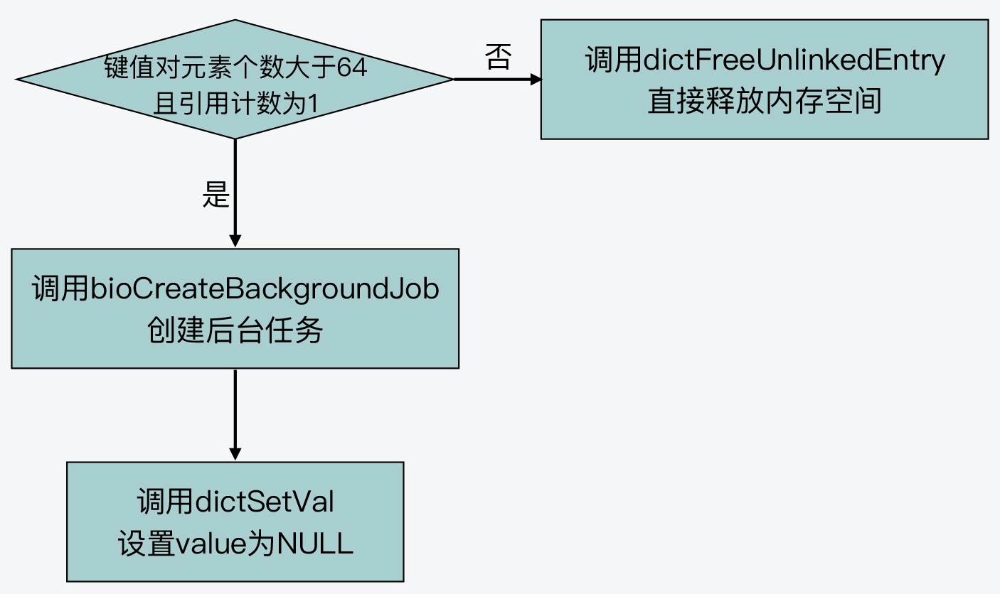

# 惰性删除 `lazy-free` 原理

## 1. 配置项

在 `redis server`开始运行时，可以配置惰性删除的相关选项。

`lazyfree-lazy-eviction` ：表示缓存淘汰时的数据删除选项，它定义在 `server.h` 中结构体`redisServer`中，默认是 `no`。

当要开启惰性删除时，将 `lazyfree-lazy-eviction` 置为 `yes`。惰性删除开启后，它会使用后台线程来执行删除数据的任务，从而避免了删除操作对主线程的阻塞。

## 2. 被淘汰数据的删除过程

在对缓存中的数据淘汰时，函数 `freeMemoryIfNeeded` 负责执行数据淘汰的过程，数据的删除过程主要分为两步。

```c
int freeMemoryIfNeeded(void) {
	...
    if (bestkey) {
            db = server.db+bestdbid;
            robj *keyobj = createStringObject(bestkey,sdslen(bestkey));
            propagateExpire(db,keyobj,server.lazyfree_lazy_eviction);
            /* We compute the amount of memory freed by db*Delete() alone.
             * It is possible that actually the memory needed to propagate
             * the DEL in AOF and replication link is greater than the one
             * we are freeing removing the key, but we can't account for
             * that otherwise we would never exit the loop.
             *
             * Same for CSC invalidation messages generated by signalModifiedKey.
             *
             * AOF and Output buffer memory will be freed eventually so
             * we only care about memory used by the key space. */
            delta = (long long) zmalloc_used_memory();
            latencyStartMonitor(eviction_latency);
            if (server.lazyfree_lazy_eviction)	// 开启惰性删除，则异步删除数据
                dbAsyncDelete(db,keyobj);
            else
                dbSyncDelete(db,keyobj);	// 同步删除数据
}
```


1. 调用 `propagateExpire` 函数，该函数根据全局变量 `server.lazyfree-lazy-eviction` 来决定删除操作具体执行哪个命令。

   ```c
   void propagateExpire(redisDb *db, robj *key, int lazy) {
       robj *argv[2];	// struct redisObject，这是共享对象的数据结构
   
       argv[0] = lazy ? shared.unlink : shared.del;	// 结构体数组第一个元素存放执行的删除命令，如果开启惰性删除，则执行unlink
       argv[1] = key;	// 第二个存放要删除的key对象
       incrRefCount(argv[0]);
       incrRefCount(argv[1]);
   
       if (server.aof_state != AOF_OFF)	// 是否开启了 AOF 日志，开启后则需把删除命令写入 AOF 日志
           feedAppendOnlyFile(server.delCommand,db->id,argv,2);
       replicationFeedSlaves(server.slaves,db->id,argv,2);		// 删除操作同步给从节点，保证主从数据一致性
   
       decrRefCount(argv[0]);
       decrRefCount(argv[1]);
   }
   ```

   如果开启了惰性删除选项，则执行 `unlink` 命令，否认执行 `del` 命令。

2. 根据是否开启惰性删除选项，`server` 决定是 **同步删除** 数据还是 **异步删除** 数据。

   如果开启惰性删除，则 `freeMemoryIfNeeded` 函数调用 `dbAsyncDelete` 函数进行异步删除，否则是同步删除 `dbSyncDelete`。

## 3. 数据删除操作

数据删除操作包括两个步骤：从哈希表中删除要淘汰的键值对、释放被淘汰键值对所占用的内存空间。

因此，如果上述两个步骤一起执行，则为 **同步删除**；否则只做步骤一，步骤二由后台线程执行，则为 **异步删除**。

同步删除和异步删除分别由 `dictDelete` 和 `dictUnlink` 来执行，如下：

```c
/* Remove an element, returning DICT_OK on success or DICT_ERR if the
 * element was not found. */
int dictDelete(dict *ht, const void *key) {
    return dictGenericDelete(ht,key,0) ? DICT_OK : DICT_ERR;
}

/* Remove an element from the table, but without actually releasing
 * the key, value and dictionary entry. The dictionary entry is returned
 * if the element was found (and unlinked from the table), and the user
 * should later call `dictFreeUnlinkedEntry()` with it in order to release it.
 * Otherwise if the key is not found, NULL is returned.
 *
 * This function is useful when we want to remove something from the hash
 * table but want to use its value before actually deleting the entry.
 * Without this function the pattern would require two lookups:
 *
 *  entry = dictFind(...);
 *  // Do something with entry
 *  dictDelete(dictionary,entry);
 *
 * Thanks to this function it is possible to avoid this, and use
 * instead:
 *
 * entry = dictUnlink(dictionary,entry);
 * // Do something with entry
 * dictFreeUnlinkedEntry(entry); // <- This does not need to lookup again.
 */
dictEntry *dictUnlink(dict *ht, const void *key) {
    return dictGenericDelete(ht,key,1);
}
```

数据的删除操作由定义在文件 `dict.c` 中的函数 `dictGenericDelete` 来执行，根据传入的参数 `nofree` 来决定是否同步或异步删除数据。

```c
static dictEntry *dictGenericDelete(dict *d, const void *key, int nofree) {
    uint64_t h, idx;
    dictEntry *he, *prevHe;
    int table;

    if (d->ht[0].used == 0 && d->ht[1].used == 0) return NULL;

    if (dictIsRehashing(d)) _dictRehashStep(d);
    h = dictHashKey(d, key);	// 查找 key 对应的哈希值

    for (table = 0; table <= 1; table++) {
        idx = h & d->ht[table].sizemask;	// 根据key计算对应的哈希桶编号
        he = d->ht[table].table[idx];	// 获取key所在哈希桶的第一个哈希项
        prevHe = NULL;
        while(he) {	// 遍历key是否存在
            if (key==he->key || dictCompareKeys(d, key, he->key)) {
                /* Unlink the element from the list */
                if (prevHe)
                    prevHe->next = he->next;
                else
                    d->ht[table].table[idx] = he->next;
                if (!nofree) {	// 如果是同步删除，则立即释放key和val的内存空间
                    dictFreeKey(d, he);
                    dictFreeVal(d, he);
                    zfree(he);
                }
                d->ht[table].used--;
                return he;
            }
            prevHe = he;
            he = he->next;
        }
        if (!dictIsRehashing(d)) break;
    }
    return NULL; /* not found */
}
```

## 4. 异步删除和同步删除

异步删除过程首先由 `lazyfreeGetFreeEffort` 函数评估被删除键值对的删除开销，当被淘汰的键值对包含超过 `64` 个元素的集合类型时，则创建后台线程来执行删除操作。否则 **主线程** 直接调用 `dictFreeUnlinkedEntry` 来释放键值对的空间。



同步删除调用 `dictDelete` 函数 `--->` `dictGenericDelete(ht,key,0)`，来执行。

