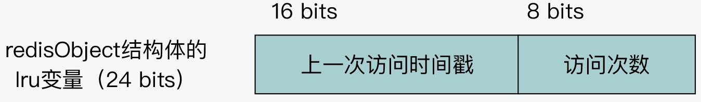

- [`LFU` 算法实现过程](#lfu-算法实现过程)
- [1. `LFU` 算法思想](#1-lfu-算法思想)
- [2. 实现过程](#2-实现过程)
  - [2.1 键值对访问频率的计算](#21-键值对访问频率的计算)
  - [2.2 键值对访问频率的初始化与更新](#22-键值对访问频率的初始化与更新)
    - [2.2.1 根据上一次访问时间的间隔，衰减访问次数](#221-根据上一次访问时间的间隔衰减访问次数)
    - [2.2.2 按概率增加当前访问次数](#222-按概率增加当前访问次数)
    - [2.2.3 更新 `lru` 变量](#223-更新-lru-变量)
  - [2.3 `LFU` 算法淘汰数据](#23-lfu-算法淘汰数据)

# `LFU` 算法实现过程

# 1. `LFU` 算法思想

`LFU` 算法是缓存淘汰的一种策略，表示「最不频繁使用」的算法。它根据 **数据的访问频率**，会淘汰缓存中最不频繁访问的数据。

# 2. 实现过程

`LFU` 算法分为三个步骤来实现，分别是键值对访问频率的计算、键值对访问频率的初始化与更新和 `LFU` 算法进行数据淘汰。

在 `server.h` 中变量 `maxmemory_policy` 配置 `LRU` 和 `LFU` 的算法选项，配置为 `MAXMEMORY_FLAG_LFU` 开启 `LFU` 算法。

## 2.1 键值对访问频率的计算

`Redis` 中每个键值对的值对应了一个 `redisObject` 结构体，其中有一个占用空间为 `24 bits` 的 `lru` 变量，如下：

```c

// src/server.h

typedef struct redisObject {
    unsigned type:4;
    unsigned encoding:4;
    unsigned lru:LRU_BITS; /* LRU time (relative to global lru_clock) or
                            * LFU data (least significant 8 bits frequency
                            * and most significant 16 bits access time). */
    int refcount;
    void *ptr;
} robj;
```

当启动 `LFU` 算法时，变量 `lru` 中低 `8` 位表示 `LFU` 算法的访问次数，高 `16` 位表示 `LFU` 访问的时间戳。如下结构：




## 2.2 键值对访问频率的初始化与更新

在源码 `object.c/createObject` 函数中会根据 `maxmemory_policy` 的配置策略，初始化 `LFU` 算法的 `lru` 变量，如下：

```c

//object.c
robj *createObject(int type, void *ptr) {
    robj *o = zmalloc(sizeof(*o));
    ...
    /* Set the LRU to the current lruclock (minutes resolution), or
     * alternatively the LFU counter. */
    if (server.maxmemory_policy & MAXMEMORY_FLAG_LFU) {
        o->lru = (LFUGetTimeInMinutes()<<8) | LFU_INIT_VAL;	// LFUGetTimeInMinutes 获取当前时间，LFU_INIT_VAL 为初始值 5
    } else {
        o->lru = LRU_CLOCK();    // 使用 LRU 算法的设置
    }
    return o;
}
```

变量 `lru` 的高 `16` 位以是 `1` 分钟为精度的 `UNIX` 时间戳，由函数 `evict.c/LFUGetTimeInMinutes` 计算得到。`lru` 的低 `8` 位被设置为默认值 `5`。

当一个键值对被访问时，`Redis` 会调用 `db.c/lookupKey` 函数进行查找，它进一步调用 `updateLFU` 函数更新键值对的访问频率。

```c
// db.c
robj *lookupKey(redisDb *db, robj *key, int flags) {
    ...
    if (server.maxmemory_policy & MAXMEMORY_FLAG_LFU) {
        updateLFU(val);    // 更新 LFU 
    } else {
        val->lru = LRU_CLOCK();    // 更新 LRU 时钟值
    }
    ...
}

void updateLFU(robj *val) {
    unsigned long counter = LFUDecrAndReturn(val);    // 根据上一次访问时间间隔，衰减访问次数
    counter = LFULogIncr(counter);    // 根据衰减后的访问次数，然后增加访问次数
    val->lru = (LFUGetTimeInMinutes()<<8) | counter;    // 更新 lru 变量
}
```

访问频率的核心实现在 `db.c/updateLFU` 函数中，它的执行逻辑分为以下三步：

### 2.2.1 根据上一次访问时间的间隔，衰减访问次数

首先在函数 `evict.c/LFUDecrAndReturn` 中对访问次数进行衰减，它实现的逻辑如下：

```c
// evict.c
unsigned long LFUDecrAndReturn(robj *o) {
    unsigned long ldt = o->lru >> 8;	// 获取上一次访问时间
    unsigned long counter = o->lru & 255;	// 获取上一次访问次数
    unsigned long num_periods = server.lfu_decay_time ? LFUTimeElapsed(ldt) / server.lfu_decay_time : 0;
    if (num_periods)	// 衰减值的大小
        counter = (num_periods > counter) ? 0 : counter - num_periods;
    return counter;	// 返回衰减后的访问次数
}

/*
	* evict.c/LFUTimeElapsed 函数计算上一次访问时间距离当前时间的间隔差
	* server.lfu_decay_time 默认值为 1
	@ 返回值：
		返回衰减后的访问次数。
*/
```

因此，当这次键值对的访问距离上一次访问的间隔时间越久，它的访问次数衰减越厉害。

### 2.2.2 按概率增加当前访问次数

根据上一步计算后的衰减访问次数，传入函数 `evict.c/LFULogIncr` 中，然后实现对当前键值对访问次数的更新，它实现的逻辑如下：

```c
// evict.c
uint8_t LFULogIncr(uint8_t counter) {
    if (counter == 255) return 255;	// 访问次数最大是 255 
    double r = (double)rand()/RAND_MAX;		// 随机生成概率 r
    double baseval = counter - LFU_INIT_VAL;	// 衰减后次数和基准值的差
    if (baseval < 0) baseval = 0;
    double p = 1.0/(baseval*server.lfu_log_factor+1);	// 阈值 p 的计算方法
    if (r < p) counter++;	// 次数增加，否则不更新次数
    return counter;
}
```

随机生成一个在 `0` 到 `1` 的概率 `r`，如果概率 `r` 小于 `p` ，则增加访问次数，否则返回当前的次数，不更新。

由于 `r` 值是随机生成的，故增加访问次数主要由阈值 `p` 决定。这个更新策略如下：

1. 阈值 `p` 越小，概率值 `r` 小于 `p` 的可能性就越小，此时访问次数也越难增加；
2. 阈值 `p` 越大，概率值 `r` 小于 `p` 的可能性就越大，此时访问次数也越容易增加；

而阈值 `p` 由 `baseval` 和 `lfu_log_factor` 两个值决定。

`baseval` 为衰减后的访问次数与基准 `LFU_INIT_VAL` 的差值，`server.lfu_log_factor` 为配置项大小（默认值是 `10`）。

通过上述两步，就对当前键值对的访问次数进行了更新。

### 2.2.3 更新 `lru` 变量

当更新键值对访问次数后，接着调用函数 `evict.c/LFUGetTimeInMinutes` 获取当前 `UNIX` 时间戳，对变量的 `lru` 进行更新。

```c
//evict.c/updateLFU
val->lru = (LFUGetTimeInMinutes()<<8) | counter;    // 更新变量 lru 
```

## 2.3 `LFU` 算法淘汰数据

当实现 `LFU` 算法时，因为 `LFU `算法会对访问次数进行衰减和按概率增加，所以，它是使用 **访问次数来近似表示访问频率** 的。

数据淘汰思路和 `LRU` 算法类似，在 `evict.c/freeMemoryIfNeeded` 来执行数据淘汰过程。

缓存数据的淘汰过程如下：

|           函数名            |                         功能                         |    文件    |
| :-------------------------: | :--------------------------------------------------: | :--------: |
|      `processCommand`       |                 处理客户端发送的请求                 | `server.c` |
| `freeMemoryIfNeededAndSafe` | 判断释放内存操作是否安全，封装了`freeMemoryIfNeeded` | `evict.c`  |
|    `freeMemoryIfNeeded`     |          当超过最大缓存时，进行释放内存操作          | `evict.c`  |

