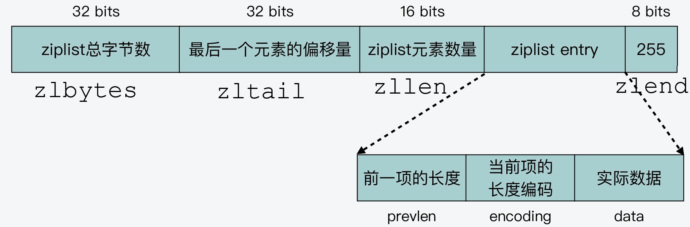
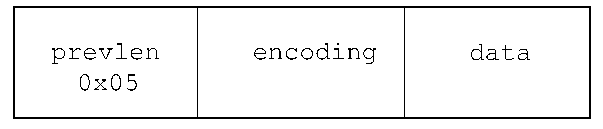
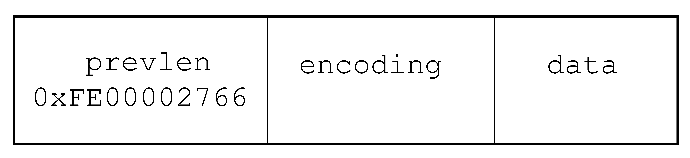

# `ziplist、quicklist、listpack` 的关系

## 1. `ziplist`

`ziplist` 是压缩列表，它是一种内存紧凑型的数据结构，占用一段连续的内存空间，以达到节省内存的目的。一个压缩列表可以包含任意多个节点，每个节点保存一个字节数组或一个整数值。

### 1.1 `ziplist`的组成

`ziplist` 列表头的各个组成部分为：

1. `zlbytes` ：占用 `4` 个字节，保存整个压缩列表的总字节数，在对压缩列表进行重新内存分配，或者定位 `zlend` 位置时使用；

2. `zltail` ：占用 `4` 个字节，记录列表表尾节点距离列表起始地址的偏移量，这样可以快速定位 `ziplist` 最后一个节点位置；

3. `zllen` ：占用 `2` 个字节，记录列表中的总节点数，列表中间可以包含若干个节点（`entry`）；

4. `zlend` ：占 `1` 个字节，是固定值 `0xFF`，表示压缩列表的结束。

如下所示：

### 1.2 `ziplist` 中节点的组成

压缩列表中每一个节点（`entry`）由 `prev_entry_length`、`encoding`、`data` 三部分组成。

#### 1.2.1 `prev_entry_length (prevlen)`

属性`prev_entry_length (prevlen)` 记录前一个节点的长度，它本身的长度是 `1`或 `5` 个字节；

> 如果前一个节点的长度小于 `254` 个字节，则 `prevlen` 属性占用的长度为 `1` 字节，否则 `prevlen` 的长度是 `5` 个字节，且属性的第一个字节是 `0xFE（十进制254）`，之后的 `4` 个字节则用于保存前一个节点的长度。

如下所示，一个节点的结构，`prevlen` 属性值是 `0x05`，表示前一个节点长度为 `5` 字节。

下图所示是包含 `5` 个字节长 `prevlen` 属性的压缩列表，属性值为 `0xFE00002766`，值的最高位字节为 `0xFE`，之后的四个字节`0x00002766` （十进制 `10086`）才是前一个节点的真实长度。

所以，属性 `prevlen` 的一个重要功能是可以根据当前节点的地址来计算出前一个节点的起始地址。
压缩列表的 **从表尾到表头遍历** 操作就是根据这一原理实现的。

#### 1.2.2 `encoding`

`encoding` 属性记录了当前节点 `data` 属性所保存数据的类型和长度：

- `1` 字节、`2` 字节或者 `5` 字节长，值的最高位为 `00、01 或 10` 的是字节数组编码：这种编码表示节点的 `data` 属性保存着字节数组，数组的长度由编码除去最高两位之后的其他位记录；
- `1` 字节长，值的最高位以 `11` 开头的是整数编码：这种编码表示节点的 `data` 属性保存着整数值，整数值的类型和长度由编码除去最高两位之后的其他位记录。

#### 1.2.3 `data`

节点 `data` 保存当前节点的实际内容，节点值可以是一个字节数组或整数，值的类型和长度由 `encoding` 属性决定。
