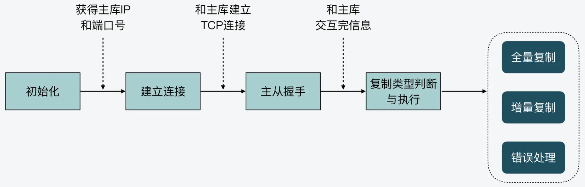

# `redis` 主从复制

# 1. 主从复制

`redis` 主从复制主要包括了 **全量复制、增量复制和长连接同步** 三种情况。

全量复制：用于传输 `RDB` 文件；

增量复制：传输主从断连期间的命令；

长连接同步：把主节点正常收到的请求传输给从节点。

# 2. 主从复制的阶段

主从复制主要分为四个阶段：初始化、建立连接、主从握手和复制类型判断与执行。

## 2.1 初始化

当一个 `redis` 实例 `A` 设置为另一个实例 `B` 的从库时，实例 `A` 要完成初始化操作。从库主要是获取主库的 `IP` 和端口号。 

## 2.2 建立连接阶段

当从库获取到主库的 `IP` 和端口号后，该实例就会尝试和主库建立 `TCP` 连接，从而可以在建立好的连接上，监听是否主库发送的命令。

## 2.3 主从握手

当从库和主库建立好连接后，该实例就会和主库进行握手。握手过程就是主从库间发送 `PING-PONG` 消息，同时从库根据配置信息向主库进行验证。

## 2.4 复制类型判断与执行

当主从库握手完成后，从库就会给主库发送 `PSYNC` 命令。主库会根据从库发送的命令参数作出相应的三种回复：执行全量备份、执行增量备份和发生错误。

最后，从库根据主回复的复制类型，执行对应的复制操作。

整个实现的阶段如下：

