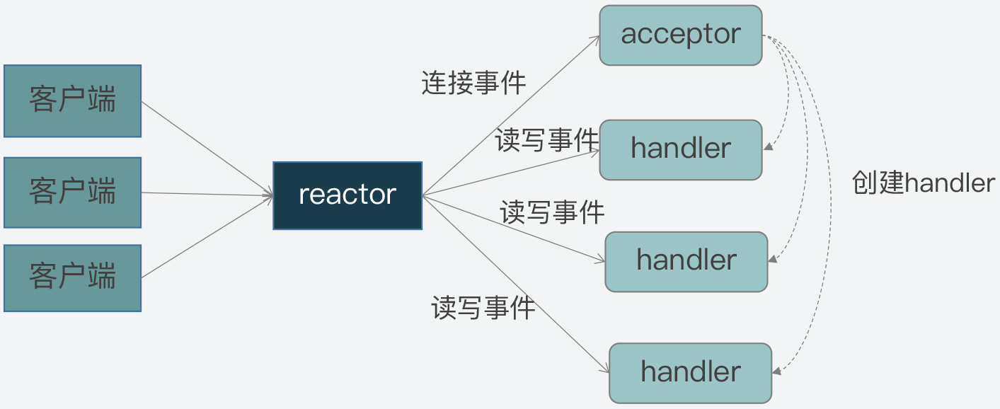

# `Redis`事件驱动框架：`Reactor`模型

# 1. `Reactor` 模型

`Reactor` 模型的核心是将多个`I/O`事件注册到一个中央多路复用器上，主线程会阻塞在多路复用器上。而当一个`I/O`事件到达或准备就绪，多路复用器会将预先注册的相应`I/O`事件返回并分发给相应的处理器。

因此，`Reactor` 模型是高性能网络系统实现高并发请求处理的一个重要技术方案。

## 1.1 事件类型与角色

`Reactor` 模型的特征可以由不同的事件类型与角色概括：

1. 事件类型：连接事件、读事件和写事件；
2. 角色类型：`reactor`、`acceptor` 和 `handler`。

### 1.1.1 事件类型

客户端与服务器在交互过程中，会产生三类不同的事件类型：

1. 连接事件：客户端向服务器发起连接请求，对应服务器的一个连接事件；
2. 写事件：服务器将客户端发送的请求处理结果写回给客户端，则对应了服务器端的写事件；
3. 读事件：服务器要从客户端读取请求内容，则对应了服务器的读事件。

### 1.1.2 事件处理

在上面的三类事件产生后，则由模型中的角色来分别处理对应事件：

1. 连接事件：由`acceptor`处理，负责服务器接收客户端的连接。`acceptor`接收连接后，会创建`handler`来处理网络连接上的读写事件；
2. 读写事件：由`handler`处理；
3. 在高并发的网络通信中，事件的到达是随机的、异步的。因此，需要一个专门的角色来监听和分配事件，即`reactor`反应器。`reactor`会将连接事件分配给`acceptor`，读写事件分配给`handler`。

# 2. `Reactor` 实现

在实现`Reactor`模型时，事件驱动框架通过包括两个部分：

1. 事件的定义与注册；
2. 事件捕获、分发和处理等

`Redis`中对`Reactor`模型的代码实现在 [`ae.h`](https://github.com/redis/redis/blob/unstable/src/ae.h) 和 [`ae.c`](https://github.com/redis/redis/blob/unstable/src/ae.c)。
