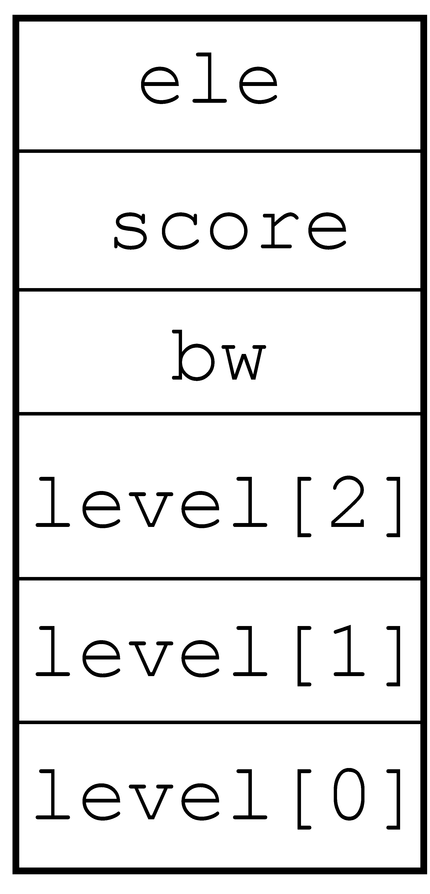
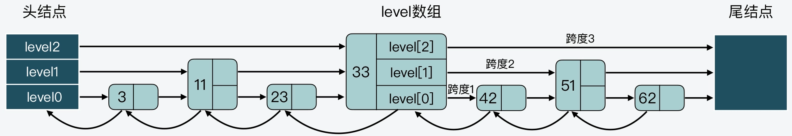

# `skiplist`

跳跃表是一种有序数据结构，它通过在每个节点中维持多个指向其他节点的指针，从而达到快速访问节点的目的。

跳表在有序集合的底层实现之一。

# 1. 跳表节点

如下是跳表节点的定义：

```c

// server.h
typedef struct zskiplistNode {
    sds ele;    // sds 对象
    double score;    // 分值：按分值从小到大排序
    struct zskiplistNode *backward;    // 后退指针，指向前一个节点
    struct zskiplistLevel {    
        struct zskiplistNode *forward;    // 前进指针，指向下一个节点
        unsigned long span;    // 节点跨度：记录当前层中两个节点间的距离
    } level[];    // 节点的层数数组
}zskiplistNode; 
```

如下，是 `3` 层 `level` 数组的节点结构：



# 2. 跳表

```c
typedef struct zskiplist {
    struct zskiplistNode *header, *tail;	// 跳表的头尾指针
    unsigned long length;	// 跳表中的节点个数
    int level;    // 保存跳表中的节点的最大层数
} zskiplist;
```

因此，跳表是一个「**有序链表+多层索引**」的结构，它支持平均`O(logn)`、最坏`O(n)`复杂度的节点查找，还可以通过顺序性批量处理节点。跳表的效率可以和平衡树媲美，而且实现比平衡树要简单，因此可以使用跳表来替代平衡树。它的结构如下：



跳表在创建节点时，采用了随机生成每个节点的层数，由`zslRandomLevel`函数决定，那么每个节点增加一层的概率不超过`25%`，可以避免由于新增节点时，引起节点层数的连锁更新问题。

```c
// z_set.c
#define ZSKIPLIST_MAXLEVEL 64 /* Should be enough for 2^64 elements */
#define ZSKIPLIST_P 0.25      /* Skiplist P = 1/4 */

int zslRandomLevel(void) {
    int level = 1;    // 节点默认最小层数是 1
    while ((random()&0xFFFF) < (ZSKIPLIST_P * 0xFFFF))
        level += 1;    // 增加一层
    return (level < ZSKIPLIST_MAXLEVEL) ? level : ZSKIPLIST_MAXLEVEL;
}

```

跳表在执行查询操作时，首先在跳表的最高层开始查询，层数越高，节点越少。

# 3. 有序集合

有序集合的定义：包含了一个字典和一个跳表。

```c
typedef struct zset {
    dict *dict;    // 字典
    zskiplist *zsl;    // 跳表
} zset;
```

