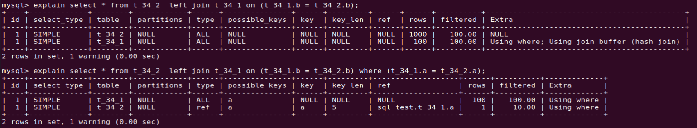
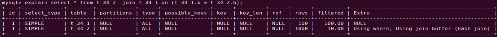

# MySQL join 用法

------

## 1. join 基本用法

`join` 用在 `select` 语句中关联表，因此称为联结。下面是 `join` 语法的几种不同用法。

### 1.1 join 语法

语句联结中可以直接使用 `join` 语义，那么这个语句在执行过程中，优化器会根据表的结构进行优化指定驱动表和被驱动表。

### 1.2 straight_join 语法

`straight_join` 让`MySQL` 采用固定的联结方式，即严格指定其左边的表是驱动表，右边的表是被驱动表。如下语句：

```mysql
CREATE TABLE `t2` 
( `id` int(11) NOT NULL, 
 `a` int(11) DEFAULT NULL, 
 `b` int(11) DEFAULT NULL, 
 PRIMARY KEY (`id`), 
 KEY `a` (`a`)
)ENGINE=InnoDB;

create table t1 like t2;

select * from t1 straight_join t2 on (t1.a=t2.a); -- 表 t1 是驱动表，t2 是被驱动表。优化器不再优化联结顺序，按指定的方式 JOIN

```

### 1.3 left join 语法

在语句中使用了 `left join` 方式，大部分情况其左边的表是驱动表，右边的表是被驱动表。但是优化器可能会优化联结表的顺序，即其左边的表不一定是驱动表，要根据语句的实际执行情况分析。例如：在条件筛选时使用 `where` 语义，如下场景实验结果：



## 2. join 的相关算法

`join` 语义在联结相关表时，根据语句的不同条件采用不同的算法。

### 2.1 Index Nested-Loop Join

这个算法是循环嵌套联结算法，简称 `NLJ` 算法。这个算法的使用场景是 **使用了被驱动表的索引**。
如上面的执行语句 `select * from t1 straight_join t2 on (t1.a=t2.a);`，在联结过程中使用了被驱动表 `t2` 上的索引 `a`，使用的是 `NLJ` 算法。 

算法的执行流程如下：

1.  取表 `t1` 中的一行数据 `R`；
2.  从数据行 `R` 取出字段 `a`，然后和表 `t2` 中的 `a` 比较；
3.  取表 `t2` 中的满足条件的数据，和 `R` 组成一行，作为结果集的一部分；
4.  重复执行步骤 `1,2,3` 直到表 `t1` 的末尾循环结束。

因此，在这种场景中，小表适合做驱动表，然后使用被驱动表上的索引，语句的查询性能较高。

### 2.2 Block Nested-Loop Join

当被驱动表上没有索引时，`join` 联结过程中使用该算法，简称 `BNL` 算法。
在 `MySQL 8.0` 版本之后，改为了 `hash join` 算法。用 `explain` 命令查看时，如下输出：(实验是建表是 `t_34_2` 等，直接使用 `join` 语义)
表中的字段 `b` 没有索引，使用 `join buffer` 缓冲区，然后使用 `hash join` 算法。



 这个算法的流程如下：

1.  

