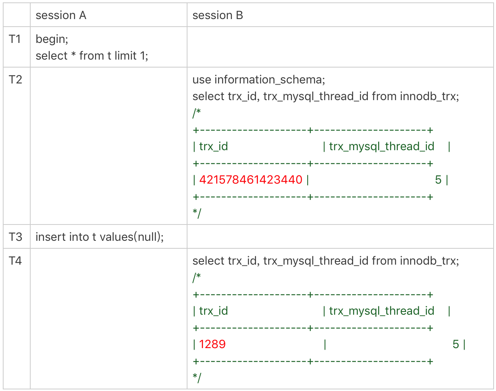

- [MySQL 自增主键用完怎么办？](#mysql-自增主键用完怎么办)
	- [1. 表定义自增主键 `id`](#1-表定义自增主键-id)
	- [2. `InnoDB` 引擎的自增 `row_id`](#2-innodb-引擎的自增-row_id)
	- [3. `Xid`](#3-xid)
	- [4. `trx_id`](#4-trx_id)
	- [5. `thread_id`](#5-thread_id)

# MySQL 自增主键用完怎么办？

`MySQL` 中存在很多自增的 `id`，每个自增 `id` 都定义了初始值，并通过加步长不断递增。因此，这些自增 `id` 是有上限的。


## 1. 表定义自增主键 `id`

当表定义的自增主键 `id` 达到上限时，再次申请的主键 `id` 值不变，导致插入数据时会报主键冲突。例如以下场景：（`unsigned int : 2^32-1 = 4294967295`）

```mysql
mysql> create table t_45 (id int unsigned primary key auto_increment)auto_increment=4294967295;		-- 指定了当前主键 id 为 4294967295
Query OK, 0 rows affected (0.08 sec)

mysql> show create table t_45;
+-------+--------------------------------------------------------------------------------------------------------------------------------------------------------------------------------------+
| Table | Create Table                                                                                                                   

| t_45  | CREATE TABLE `t_45` (
  `id` int unsigned NOT NULL AUTO_INCREMENT,
  PRIMARY KEY (`id`)
) ENGINE=InnoDB AUTO_INCREMENT=4294967295 DEFAULT CHARSET=utf8mb4 COLLATE=utf8mb4_0900_ai_ci |
+-------+--------------------------------------------------------------------------------------------------------------------------------------------------------------------------------------+
1 row in set (0.10 sec)

mysql> insert into t_45 values(null);
Query OK, 1 row affected (0.00 sec)

mysql> insert into t_45 values(null);
ERROR 1062 (23000): Duplicate entry '4294967295' for key 't_45.PRIMARY'
mysql> 

```

当出现这种情况时，可以将自增主键 `id` 类型改为 `8` 字节的 `bigint unsigned ` 类型。

## 2. `InnoDB` 引擎的自增 `row_id`

当创建的 `InnoDB` 表没有定义主键时，`InnoDB` 系统内会默认创建一个不可见的、长度是 `6` 个字节的 `row_id` ，范围是`[0, 2^48-1]`。

> 实际上，`row_id` 是 `bigint unsigned` 的 `8` 字节无符号长整型，但是，`InnoDB` 是设计时，只取了低 `6` 个字节的长度。

`InnoDB` 维护着一个全局的 `dict_sys.row_id` 值，所有无主键的 `InnoDB` 表，在插入一行数据时，都将当前的 `dict_sys.row_id` 作为要插入数据的主键 `row_id`，然后 `dict_sys.row_id` 值加 `1` 。

当 `dict_sys.row_id` 值达到上限时 ，然后再有插入数据申请 `row_id` 时，下一个值就是 `0`，即 `row_id` 会循环使用。因此，在这种情况下，新插入数据的会覆盖 之前表中已有的相同 `row_id` 的数据行。

综上，结合第 `1、2` 分析，我们在创建表时，最好主动创建自增主键，这样在有重复的 `id` 时，会报主键冲突的错误。因为对于覆盖数据，它会导致数据丢失，影响的是数据的可靠性。而主键冲突报错是影响数据的可用性，在数据库系统中，**可靠性优于可用性**。

## 3. `Xid`

`Xid` 是 `MySQL` 日志 `redo log` 和 `binlog` 为保证主备数据可靠性在相互配合时的一个共同字段，它在 `MySQL server`层中维护用来对应于事务的。
主要用在 `binlog` 日志文件中，而 `redo log` 日志中的 `Xid` 由 `InnoDB` 引擎维护的。

## 4. `trx_id`

`InnoDB` 引擎中用来维护的事务 `id` 的标识符，主要用在事务隔离级别的实现上。
`InnoDB` 内部维护了一个 `max_trx_id` 全局变量，每次开启一个新事务时，就将当前 `max_trx_id` 赋值给申请的新事务，然后将 `max_trx_id` 值加 `1`。

`InnoDB` 数据可见性的核心思想是：事务在更新每行数据时都记录了事务本身的 `trx_id`，当一个事务读到一行记录时，判断这行记录的可见性原则就是通过事务的一致性视图和这行记录的 `trx_id` 比较。对于正在执行的事务，可以通过 `information_schema.innodb_trx` 表中查看系统中的事务 `trx_id`。

```mysql
mysql> use information_schema;
mysql> select trx_id , trx_mysql_thread_id from innodb_trx;	-- InnoDB 中的事务 trx_id, 和当前连接线程的 id
+-----------------+---------------------+
| trx_id          | trx_mysql_thread_id |
+-----------------+---------------------+
| 421923138223512 |                  10 |
+-----------------+---------------------+
1 row in set (0.00 sec)

```

如以下实验结果：在 `T1 `时刻，`session A `还没有涉及到更新，是一个只读事务。而对于只读事务，`InnoDB` 并不会分配 `trx_id`。对于只读事务，`InnoDB` 暂不会分配 `trx_id`。所以，在 `session B` 中 `T2` 时刻查询到的 `trx_id` 是一个很大的随机值。直到 `T3` 时刻事务 `A` 进行插入操作，才真正分配了 `trx_id`，再次查询`trx_id` 时，该值就正常显示了。




## 5. `thread_id`

`MySQL` 中用来标识每个连接线程 `id` 的编号，在 `show processlist` 命令中的第一列 `id` 即为每个线程的 `thread_id`。
系统中保存着一个全局变量 `thread_id_counter`，每新接入一个连接，就将 `thread_id_counter` 的当前值赋值给新连接的线程变量。
这个变量是 `4` 个字节的无符号整型( `[0, 2^32-1]` )，当达到最大值后，重新申请为 `0`，但不会出现相同的 `thread_id`，因为 `MySQL` 设计了一个唯一数组的逻辑实现，代码如下：

```mysql
-- 分配新的 `thread_id` 
do {
  new_id= thread_id_counter++;
} while (!thread_ids.insert_unique(new_id).second);

-- insert_unique
std::pair<iterator, bool> insert_unique(const value_type &val) { 
	
	std::pair<iterator, iterator> p= std::equal_range(begin(), end(), val); // p.first == p.second means we did not find it. 
	if (p.first == p.second) 
		return std::make_pair(insert(p.first, val), true); 
	return std::mak e_pair(p.first, false); 
} 

/*
MySQL通过 Thread_id_array 来维护当前所有的线程，插入时会判断当前是否已经存在了此id。
假设当前已经自增到了最大值，再往后就是0，如果id为0的线程未释放，仍然被占用，则会继续递增，直到出现尚未被占用的id号，所以如果数据库中从0到2^32-1都已经被占用，会出现死循环。 当客户端连接关闭时，会调用函数release_thread_id,从thread_ids移除当前id号。
*/
```

