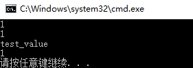

# `leveldb`编译与使用

`leveldb` 是一个快速的键值数据库，实现了从 `string key` 到 `string value` 的有序映射。

## 1. `win10` 编译

在 `win10` 操作系统编译步骤如下。

### 1.1 `leveldb`源码下载

打开[`leveldb`官方](https://github.com/google/leveldb)，然后下载源码：

`git clone --recurse-submodules https://github.com/google/leveldb.git`

### 1.2 使用`cmake` 和 `Visual Studio 2019`

`win10` 下需提前安装好`cmake`和 `vs2019`。

在`vs2019`目录下的`x64 Native Tools Command Prompt for VS 2019`终端命令行执行：

```shell
mkdir build && cd build
cmake -G "Visual Studio 16" ..
```

或者直接在系统`cmd`命令行中执行：

`cmake -G "Visual Studio 16" -A x64 ..`（生成`64`位架构文件）

命令执行后，会在`build`目录下生成`leveldb.sln`方案，使用`vs2019`打开，选择`Release、x64`配置，然后编译整个项目直到成功，在`build/Release`目录下生成一个`64`位的`leveldb.lib`库文件。

### 1.3 测试

新建一个项目文件，添加一个源码`cpp`文件。在项目属性中`Configuration Properties`配置以下选项：

#### 1.3.1 `C/C++` 配置

`General -> Additional Include Directories`中加入`leveldb`源码的路径：

```c++
.\src\leveldb 
.\src\leveldb\include    // leveldb 源码的头文件

```

#### 1.3.2 `Linker` 配置

`General -> Additional Library Directories` 中加入库`leveldb.lib`的路径：`.\src\leveldb\build\Release`。

`Input -> Additional Dependencies`中添加库名`leveldb.lib`。

#### 1.3.3 代码测试

在配置完项目属性后，源码文件中加入以下代码：

```c++
#include <iostream> 
#include <leveldb/db.h>
#include <leveldb/write_batch.h>

int main()
{
    leveldb::DB* db;
    leveldb::Options options;
    options.create_if_missing = true;
    std::string dbpath = "testdb";
    leveldb::Status s = leveldb::DB::Open(options, dbpath, &db);    // 打开一个 leveldb 数据库, 对应于当前路径下 testdb 目录
    assert(s.ok());
    std::string key1 = "test";
    std::string val = "test_value";

    s = db->Put(leveldb::WriteOptions(), key1, val);    // 在数据库中插入(key1, val)键值对
    std::cout << s.ok() << std::endl;
    std::string key2;
    s = db->Get(leveldb::ReadOptions(), key1, &val);    // 获取键key对应的值val
    std::cout << s.ok() << std::endl;
    std::cout << val << std::endl;
    
    /*
    if (s.ok())    // 将key1对应的值改为key2的值
    {
        s = db->Put(leveldb::WriteOptions(), key2, val);
        s = db->Delete(leveldb::WriteOptions(), key1);
    }
    */

    if (s.ok())    // 使用WriteBatch类原子性地提交一组更新
    {
        leveldb::WriteBatch batch;
        batch.Delete(key1);    // 删除键key1
        batch.Put(key2, val);    // 插入键值对（key2，val）
        s = db->Write(leveldb::WriteOptions(), &batch);
    }

    std::cout << s.ok() << std::endl;
    
    s = db->Get(leveldb::ReadOptions(), key2, &val);
    std::cout << s.ok() << " " << val << std::endl;
    delete db;    // close db
    return 0;
}

```

编译成功并运行后，有以下输出：



## 2. mac 编译

`mac` 系统的安装较简单。
使用如下命令编译源码成功后，将在 `build` 目录下生成库文件 `libleveddb.a`。

```shell

mkdir -p build && cd build
cmake -DCMAKE_BUILD_TYPE=Release .. && cmake --build .
# 安装 leveldb 库
make install

#
brew install leveldb

```

## 3. 代码

新建一个文件夹，然后创建测试源码文件。编译如下：

```shell
# 方法 1：编译源码，每次手动链接头文件和库文件
# -I../src/leveldb/include/： 链接源码 include/ 目录
# -L../src/leveldb/build/：链接编译生成的 libleveldb.a 库文件
# g++ -o test test.cpp -lleveldb -lpthread -I../src/leveldb/include/ -L../src/leveldb/build/ -std=c++11


# 方法 2：将头文件和库文件复制到 /usr/local/ 系统目录，以后无须手动链接。
# 复制头文件
# sudo cp -r ./src/leveldb/include /usr/local/include/

# 复制库文件
# sudo cp ./src/leveldb/build/libleveldb.a /usr/local/lib/


# 编译命令
g++ -o test test.cpp -lleveldb -lpthread -std=c++11
```
